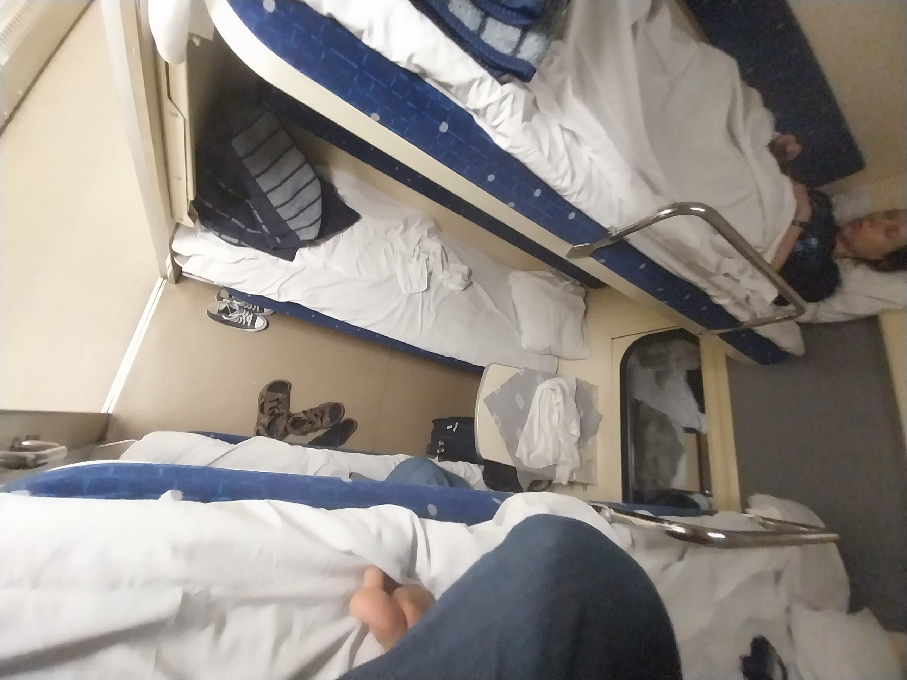
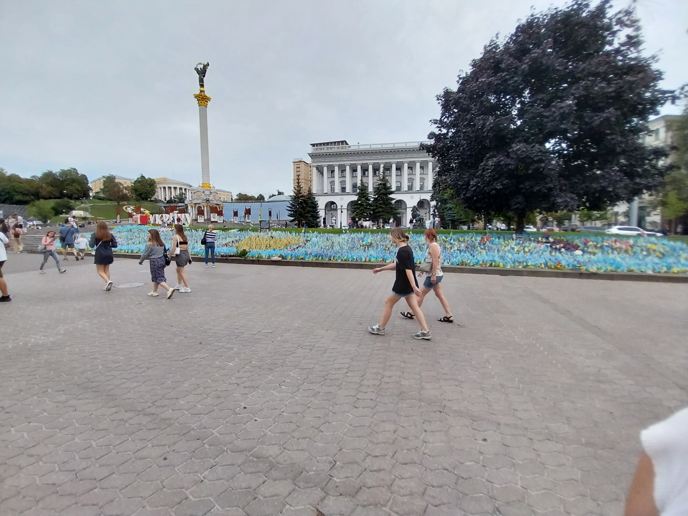

# Kyiv

## Le train couchette

Après quelque jours à Lviv, nous prenons le train de nuit pour Kyiv. C'est
quelque chose que l'on avait déjà fait en 2021, et c'est une expérience très
réconfortante.

Notre train part à 23h. Le quai n'est pas surélévé, il faut donc grimper trois 
marches étroites, et y hisser les valises. On est alors acceuilli par un
interieur fraichement peint en beige. On accede aux cabines par un couloir
étroit qui longe le coté gauche du train. Comme on est en seconde classe, il y
quatres lits par cabine, superposés par deux de chaque coté de la fenetre. Il
est flambant neuf et il y a même des petits voyants lumineux pour indiquer si
les toilettes sont libres.

On fait les lits puis on se couche l'un au dessus de l'autre. Le bruit et le
roulis du train nous berce doucement, et chaque kachlong est un rail en moins
qui nous sépare de Kyiv. Nous somme reveillé à 5h30 par l'hote de la rame qui
ammene du thé à ceux qui en ont commandé. On regarde l'Ukraine défiler pendant
une demi-heure avant de descendre du train, à Kyiv.

## La ville

On retrouve la meme ville qu'en 2021, mais beaucoup de choses ont changées.
L'immense statue de la mère patrie, installé sur une coline surplombant la ville
et le fleuve, est en train de se faire retirer le marteau et la faucille qui
ornait son bouclier. Le symbole sera remplacé par le trident national quelque
jours plus tard. On ne peut plus visiter le musée à son pied, ce qui est
vraiment dommage car il contenait en 2021 deux exposition : une sur la guerre
dans le Donbass depuis 2014, plutot moderne, et une sovietique et tres
propagandesque sur la Seconde Guerre Mondiale.

Il a toutefois un plus petit musée, avec une exposition sur l'invasion de 2022.
Un certains nombres d'objets récupérés sur des soldats russes morts sont
présentés. Le passeport d'un tres jeune citoyen de la sois-disante "République
Populaire de Louhansk" m'a particulièrement marqué. Cet état-poupée séparatiste
installé par la Russie est connu pour sa mobilisation particulièrement
agressive. Leur troupes sont connues pour être très mals équipées et entrainée,
et utilisées comme chair à canon moins couteuse politiquement que des citoyens
russes.

Sur la place de l'indépendance, dites "Maïdan", lieu de la révolution de la
dignité de 2014, il y a avait beaucoup d'installation liées a la guerre. Il y
avait un parterre de petit drapeau, chaque drapeau commemorant un soldat tombé.
Des hérissons anti-char avaient été peints. Le musée de la méduse et le centre
commercial sous-terrain Globousse étaient encore présents. 

## Les alertes

À Kyiv, on dors chez l'oncle d'Antonina, Serge. Son appartement est dans une
khruvtchevka, un immeuble de l'époque de Khroutchev. Ce sont des immeubles d'une
dizaine d'étage, ce qui est peu à Kyiv, mais assez longs. Ils sont souvent dans
un état plutot mauvais. Chaque appartement dispose d'un voir deux balcons,
construits ouverts, mais tous munis de fenetres rajoutées par les résidents,
avec du bois. Ces immeubles ont un ascenceur étroit, qui montre son age par
toute sortes de bruits menacants. Il y a souvent un jardin à leur pied, muni
d'une aire de jeux pour enfant. À l'exterieur, des escaliers recouvert d'un toit
en tole menent à un sous-sol peu engageant, dont le sol est en terre battue.

Lorsqu'il y a une alerte aérienne, on entend en premier la sonnerie de
l'application prévue à cet effet, puis des sirènes, les mêmes que les premiers
mercredis du mois en France. Lors de notre première nuit à Kyiv, Serge nous
indique qu'il les ignore. On marche quand même cinq minute pour se réfugier dans
le métro, mais les allées et venues nous donnent l'impression que l'attitude de
Serge est largement partagée. Il y aura une deuxième alerte dans la même
journée, que l'on ignorera. Le début d'une sirène ressemble beaucoup au bruit
d'une voiture qui accelère au loin, et on y devient rapidement sensible.

Antonina est abonnée à un canal télégram qui donne des informations plus
précises sur les alertes. La pluspart du temps il s'agit d'un bombardier russe
capable de lancer des missiles qui à decollé. Il ne lance pas de missile à
chaque fois, et ces missiles ayant une très grande portée, cela déclenche une
alerte dans toute l'Ukraine.

Lors de notre deuxième nuit, on est reveillés à 1h30 par une alerte. Telegram
indique qu'il s'agit de Shaheds, des drones iraniens, lents et petit, mais ayant
une grande portée et un cout très faible. On hésite un peu avant de se
recoucher. Quinze minutes plus tard, on est de nouveau réveillés, cette fois par
des explosions. Serge ne sort pas de sa chambre, et on convient avec Timothé,
son fils de 10 ans, de descendre se cacher. On juge le sous-sol trop
inconfortable et on prend la direction du métro, ce qui était une franchement
mauvaise idée puisque les explosions continuent pendant notre trajet et qu'on
apercoit même une sorte de boule de feu traverser l'horizon. On arrive au métro
ou il y a cette fois beaucoup de monde. Les plus habitués ont des matelas et des
chaises de camping. On attend une heure et demi la fin de l'alerte sur le quai.

On apprendra par la suite que tous les Shaheds ont été abattus, et que les
débris n'ont touchés personne. C'était la pire nuit à Kyiv depuis deux mois,
mais ce n'étais rien par rapport au quotidien pendant l'hiver. On nous diras
aussi que Kyiv est désormais protégées contre les missiles, grace aux defense
anti-aériennes fournies par l'occident, mais que c'est la seule ville d'Ukraine
dans ce cas. On prendra aussi l'habitude de descendre au métro lors des alertes
de Shahed, sans attendre qu'ils soient la.

