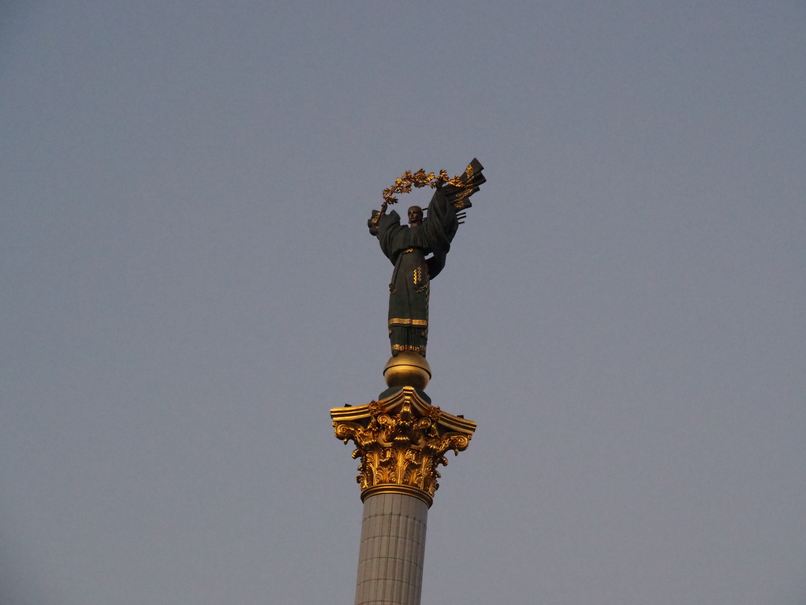
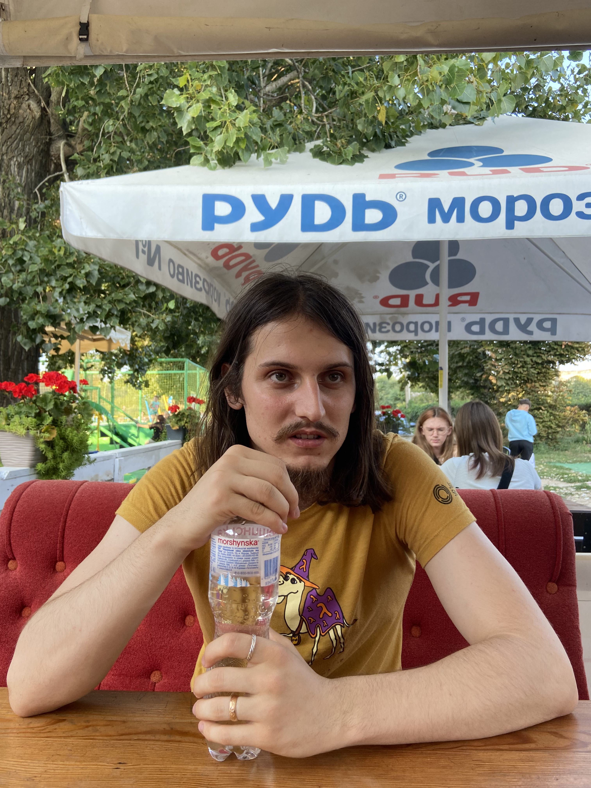
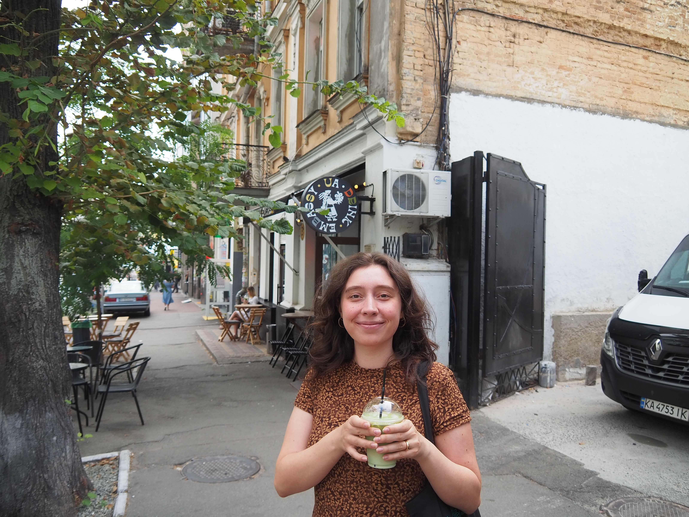
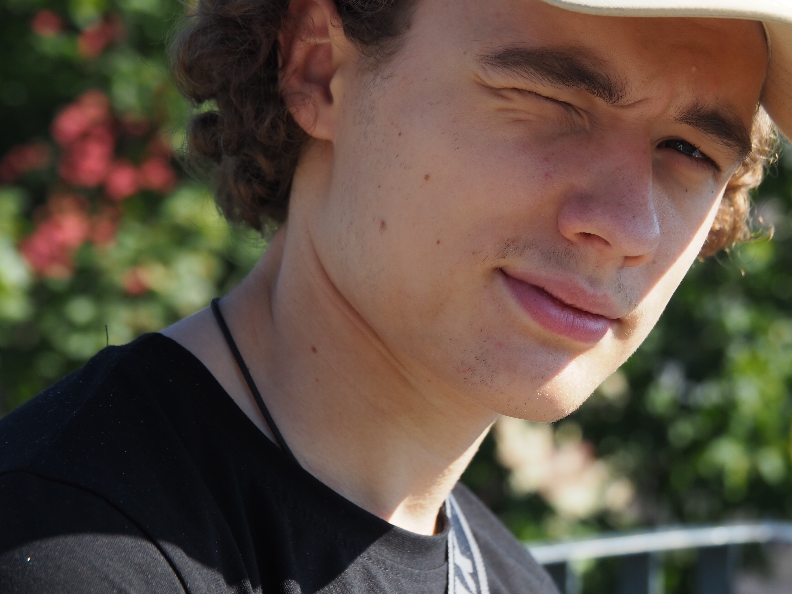
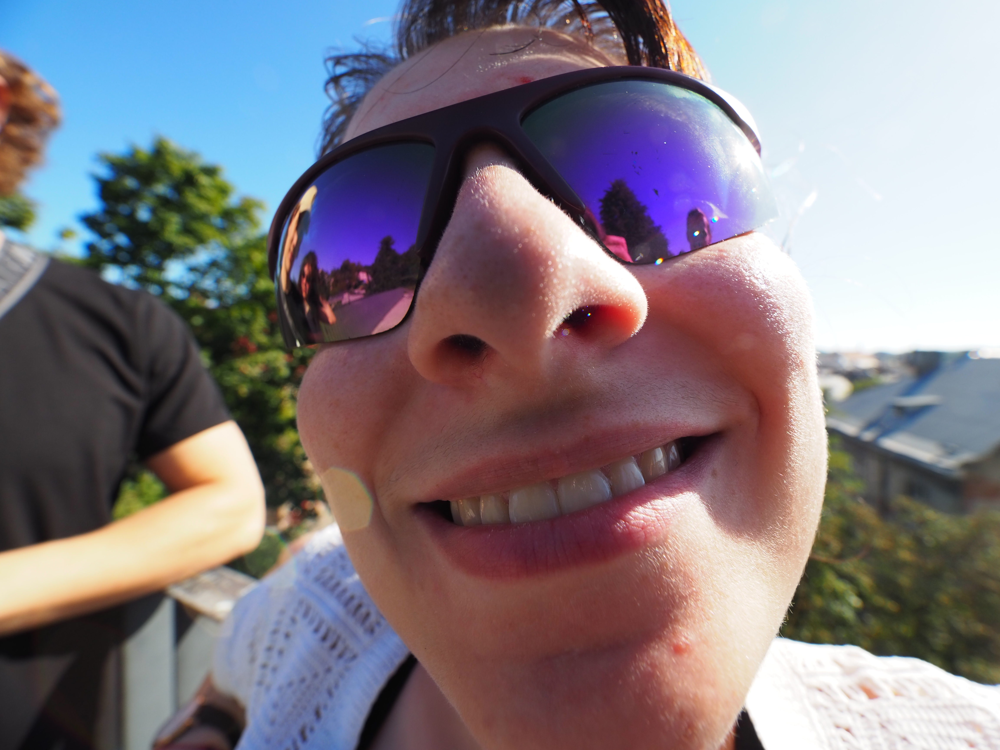
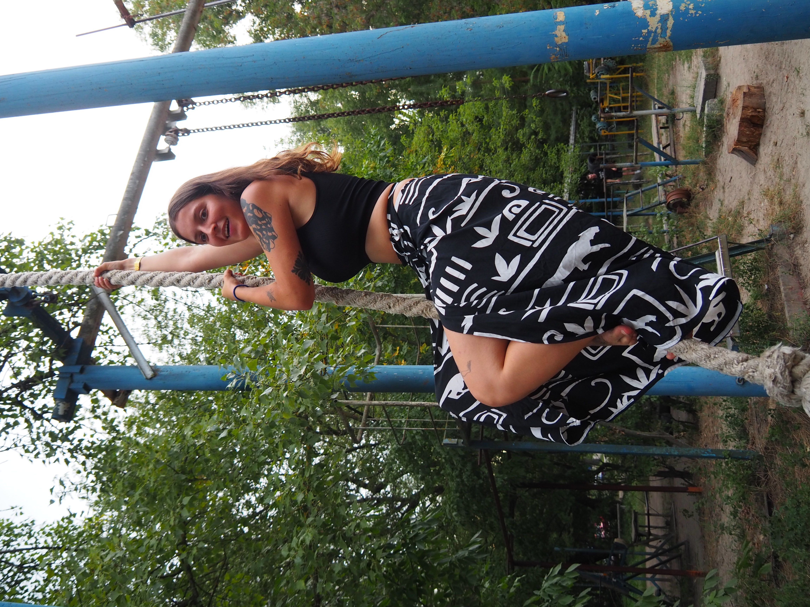

# Ukraine, été 2024

En août 2024, je retourne en Ukraine en guerre pour la deuxième fois. Cette fois
nous voyageons en groupe, avec ma femme Antonina, mes deux soeurs Alice et
Coline, et le frere d'Antonina, Vova.

Cet article raconte notre voyage, avec beaucoup de photos, prises grace à
l'appareil photo que Coline a amené. La plupart des photos ont été prises par
Coline ou par moi.

Partir en vacance en Ukraine pendant la guerre est une chose étrange, mais
extrêmement importante pour nous.

Nous avons vu de la famille, des amis, qui habitent là-bas toute l'année, et qui
n'ont pas de repos. Nous prenons un risque minime pour partager leur quotidien
quelques jours, et garder un lien avec eux et l'Ukraine.

Ce voyage est aussi assez particulier, car comme Antonina est enceinte, nous ne
sommes pas sur de pouvoir revenir en Ukraine tout les deux avant très longtemps,
car c'est un voyage très compliqué à faire avec un nouveau né.

[Page suivante: Le trajet et Lviv](lviv.md)

