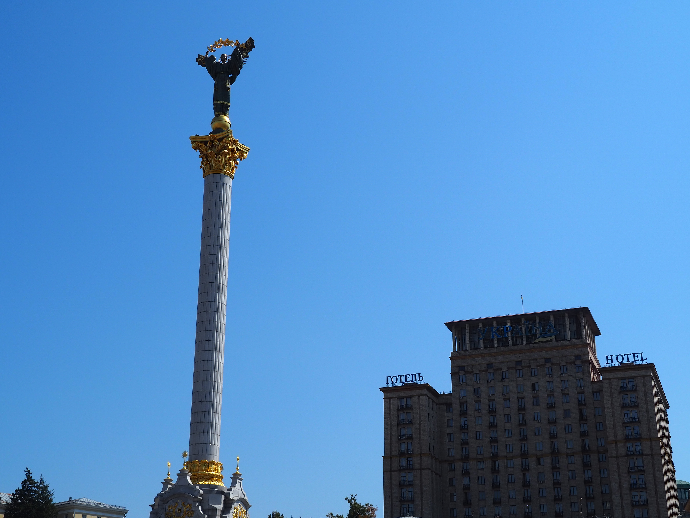

# Khreshatik

À Kyiv, notre Airbnb se situe sur Khreshatik. Khreshatik est la grande avenue de
Kyiv, équivalente aux Champs-Élysées à Paris.

En 1941, l'armée rouge en retraite piège une bonne partie des bâtiments, et
déclenche l'explosion 5 jours après la prise de contrôle de Kyiv par les
allemands. Khreshatik est ensuite reconstruite dans un style stalinien, avec
beaucoup de décorations, et des choix pas toujours utilitaristes.

Khreshatik est une grande avenue avec des trottoirs très larges, bordés de
marronniers qui sont le symbole de Kyiv.

Notre appartement est dans un immeuble typique. Les décorations sont en mauvais
état, les partie communes de l'immeuble sont trop grandes.

On a aussi vue sur le Tsoume (ЦУМ), le "Magasin central universel" (Центральний
універсальний магазин), un magasin de type "departement store" comme les
galeries Lafayette en France. C'est d'ailleurs le seul sur ce format en Ukraine.

Dans une rue perpendiculaire, on mange a Puzata Khata, la "maison bedonnante".
C'est une chaîne de restaurants en self-service qui sert de la nourriture
Ukrainienne bon marché. C'est un équivalent de Flunch en France, mais sans le
coté ringard.

On tombe aussi sur une installation artistique discrete. Il s'agit d'un accusé
de réception de messagerie, pour rappeler la difficulté de communiquer avec des
proches qui sont au front. On appuie sur un bouton pour changer si le message
est reçu, ouvert, ou juste envoyé.

# La guerre à Kyiv

À Kyiv, la guerre est plus présente qu'à Lviv. Pendant les 3 nuits passées tout
les cinq à Kyiv, une alerte de bombardement aérien sera déclenchée chaque nuit.

Les alertes sont les mêmes que celles du premier mercredi du mois en France,
sauf que c'est pas un essai, et qu'on a aussi une application sur le téléphone
car les alertes ne sont pas audible de partout.

Une alerte ne signifie pas forcément un bombardement, les munitions utilisées
par les Russes ont une très grande portée, une alerte peut être déclenchée à
Kyiv alors que les missiles visent Dnipro, car les missile peuvent frapper l'un
ou l'autre sans manière de le savoir à l'avance.

Une grande chance que l'on a est la qualité de l'abri souterrain de notre
immeuble.

Pour clarifier ce que je dis ici, les alertes aériennes ne sont pas
insignifiantes pour les Ukrainiens. Il s'agit d'une des choses les plus
désagréables concernant la vie en Ukraine pendant et cela affecte grandement le
sommeil, et il n'est pas forcément possible de juste les ignorer et de se
rendormir. Simplement, il n'est pas envisageable pour beaucoup de gens de
descendre systématiquement dans un abri car le sommeil se retrouve encore plus
perturbé.

Personnellement je n'ai pas vu d'immeuble détruits par les bombardements, mais
Vova est allé en voir près de chez son cousin.

# Maïdane

Au bout de l'avenue Khreshatik, il y a la place de l’indépendance, Maïdane.
Cette place est extrêmement importante pour les Ukrainiens, car elle fut le lieu
de la révolution de dignité, les manifestations qui ont chassé du pouvoir
Yanoukovitche en 2014 et confirmé le maintien de la démocratie Ukrainienne
ainsi que son indépendance totale à la Russie.

Depuis le début de l'invasion totale, les proches de soldats tombés viennent
placer un petit drapeau dans la pelouse de Maïdane. Ils sont maintenant très nombreux.

# Les passages souterrains

Il y a aussi à Maïdane un centre commercial souterrain, "Globousse" avec plusieurs sorties et
passages. Les passages souterrains sont courants à Kyiv et permettent de se
passer de passage piéton.

[Page suivante : Materiya](kyiv_2_materiya.md)