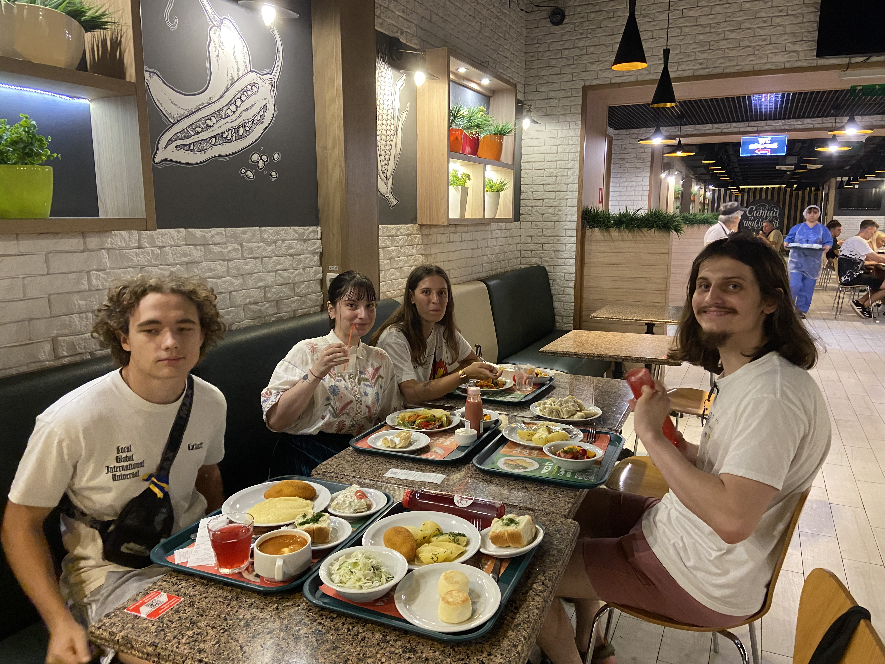

# L'arrivée à Kyiv

## Khrechatik

À Kyiv, notre Airbnb se situe sur Khrechatik. Khrechatik est la grande avenue de
Kyiv, équivalente aux Champs-Élysées à Paris.

En 1941, l'Armée Rouge en retraite piège une bonne partie des bâtiments, et
déclenche l'explosion cinq jours après la prise de contrôle de Kyiv par les
Allemands. Khrechatik est ensuite reconstruite dans un style stalinien, avec
beaucoup de décorations, et des choix pas toujours utilitaristes : on sent que
le projet de modernisation de l'avenue avait vocation à apporter du prestige à
la ville, plus qu'un grand nombre de logements, contrairement par exemple aux
[khrouchtchevkas](https://fr.wikipedia.org/wiki/Khrouchtchevka).

Khrechatik est une grande avenue avec des trottoirs très larges, bordés de
marronniers qui sont le symbole de Kyiv.

Notre appartement est dans un immeuble typique. Les décorations sont en mauvais
état, les parties communes de l'immeuble sont trop grandes (couloirs larges
comme un salon, cages d'escalier à n'en pas finir...).

On a aussi vue sur le Tsoume (ЦУМ), le « Magasin central universel » (Центральний
універсальний магазин), un magasin de type _departement store_ comme les
Galeries Lafayette en France. C'est d'ailleurs le seul sur ce format en Ukraine.
Il a été complètement rénové en 2017 après une très longue fermeture. C'est
aujourd'hui un lieu de shopping de luxe ; ce n'était pas le cas sous l'URSS, où
c'était un magasin plutôt classique. Une évolution assez similaire à celle des
_departement store_ occidentaux.

Dans une rue perpendiculaire, on mange à Puzata Khata, la "maison bedonnante".
C'est une chaîne de restaurants en self-service qui sert de la nourriture
ukrainienne bon marché. C'est un équivalent de Flunch en France, mais sans le
côté ringard (et meilleur d'après Alice).

On tombe aussi sur une installation artistique discrète. Il s'agit d'un accusé
de réception de messagerie, pour rappeler la difficulté de communiquer avec des
proches qui sont au front. On appuie sur un bouton pour changer si le message
est reçu, ouvert, ou juste envoyé.

## La guerre à Kyiv

À Kyiv, la guerre est plus présente qu'à Lviv. Pendant les trois nuits passées tous
les cinq à Kyiv, plusieurs alertes de bombardement aérien ont eu lieu.

Les alertes sont les mêmes que celles du premier mercredi du mois en France,
sauf que ce n'est pas un essai. Il y a aussi une application sur le téléphone
car les alertes ne sont pas audibles de partout.

Une alerte ne signifie pas forcément un bombardement. Les munitions utilisées
par les Russes ont une très grande portée, une alerte peut être déclenchée à
Kyiv alors que les missiles visent Dnipro, car les missile peuvent frapper l'un
ou l'autre sans manière de le savoir à l'avance.

On a eu beaucoup de chance, car l'abri souterrain de notre immeuble était très
bien. Tous les immeubles n'ont pas un abri, et quand il y en a un, il n'est pas
forcement confortable. Sans abri, on aurait dû marcher 300 mètres jusqu'au métro
à chaque alerte.

Les alertes aériennes ne sont pas
insignifiantes pour les Ukrainiens. Il s'agit d'une des choses les plus
désagréables concernant la vie en Ukraine pendant la guerre, qui affecte
grandement le sommeil. Il n'est pas envisageable pour beaucoup
de gens de descendre systématiquement dans un abri car le sommeil se retrouve
encore plus perturbé. Il n'est pas non plus forcément possible de juste les
ignorer et de se rendormir, même lorsque l'on est "habitué".

Personnellement je n'ai pas vu d'immeubles détruits par les bombardements, mais
Vova est allé en voir près de chez son cousin.

Il y a aussi pas mal de communication autour de la guerre dans la rue.

, célèbre artiste Ukrainienne des années 60 assassinée par le KGB à 41 ans.](images/kyiv/p1/fresque_faucon.jpg)

## Maïdane

Au bout de l'avenue Khrechatik, il y a la place de l’indépendance, Maïdane.
Cette place est extrêmement importante pour les Ukrainiens, car elle fut le lieu
de la Révolution de la Dignité, les manifestations qui ont chassé du pouvoir
Yanoukovitche en 2014 et confirmé le maintien de la démocratie ukrainienne
ainsi que son indépendance totale de la Russie.

Depuis le début de l'invasion totale, les proches de soldats tombés viennent
placer un petit drapeau dans la pelouse de Maïdane. Ils sont maintenant très
nombreux, on voit leur nombre grandir à chaque voyage.

## Les passages souterrains

Il y a aussi à Maïdane un centre commercial souterrain, "Globousse" avec plusieurs sorties et
passages. Les passages souterrains sont courants à Kyiv et permettent de se
passer de passage piéton.

[Page suivante : Materiya](kyiv_2_materiya.md)
