# L'arche de la liberté du peuple Ukrainien

En poursuivant après la maison de l'Ukraine, on arrive à l'Arche de la liberté
du peuple Ukrainien. Il s'agit d'une grande arche en alliage de titane,
construite par le pouvoir soviétique sous le nom de _L'Arche de l'amitié entre
les peuples_, pour célébrer l'amitié des peuples Russes et Ukrainiens. Ce
message est évidemment moins audible de nos jours, et ne l'a d'ailleurs jamais
réellement été lorsque l'on connaît les nombreux crimes commis par le pouvoir
Moscovite de l'URSS à l'encontre du peuple Ukrainien
([génocide](https://fr.wikipedia.org/wiki/Holodomor),
[russification](https://fr.wikipedia.org/wiki/Russification_de_l%27Ukraine)).
Certains surnomment cette Arche "le Joug". D'ailleurs, en 2018, avant qu'elle
soit renommée, une fissure a été peinte sur l'Arche par des activistes des
droits de l'homme pour protester contre l'agression russe de l'Ukraine.

L'Arche est donc renommée en 2022, et les parties les plus visiblement
pro-russes démantelées : la statue d'un ouvrier Russe et d'un Ukrainien, ainsi
qu'une stèle commémorant le [traité de
Pereïaslav](https://fr.wikipedia.org/wiki/Trait%C3%A9_de_Pere%C3%AFaslav_(1654))
qui rattache l'Ukraine à l'Empire Russe.

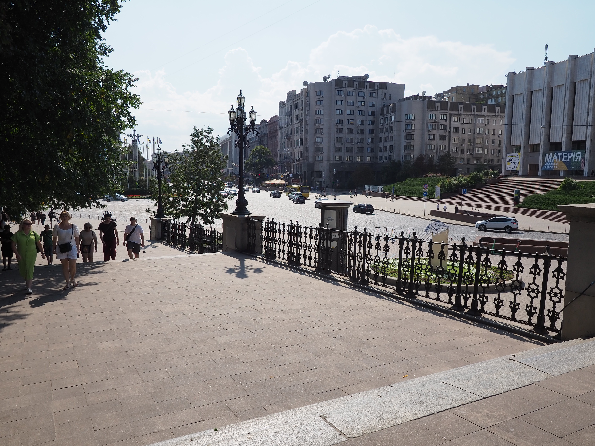

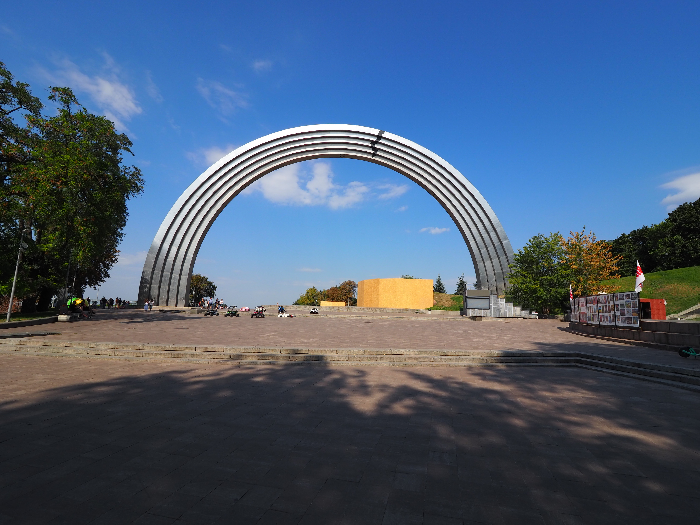

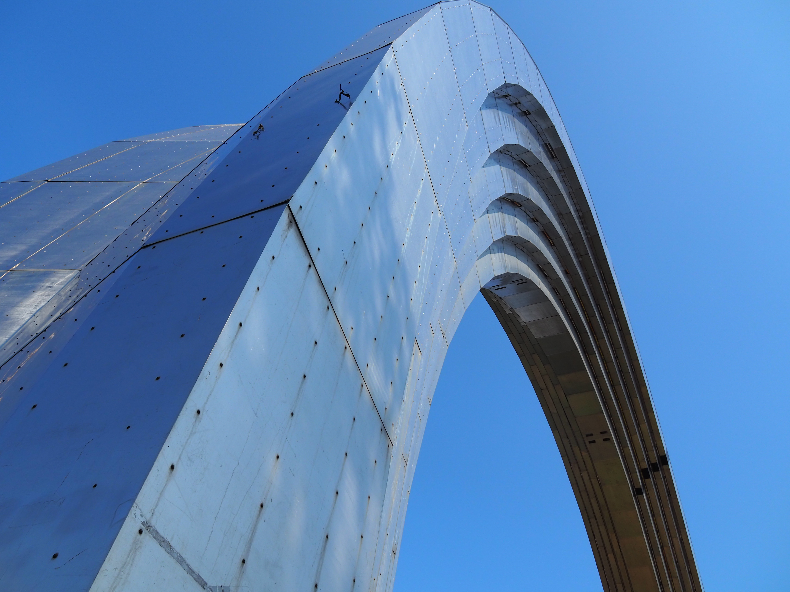

À gauche de l'Arche il y a un pont piéton, qui a [manqué d’être détruit par un
missile russe en 2022](https://www.youtube.com/watch?v=AyUqrFEsU3k), et duquel
on a un très beau point de vue sur Kyiv.

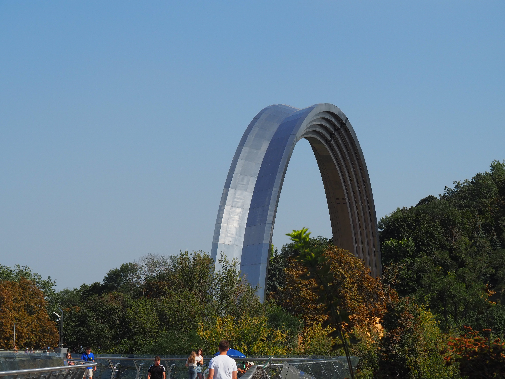

Le pont dispose de plaques en verre comme attraction, mais elles sont très rayés
et sales, et donc pas très impressionnantes. La vue vaut tout de même la peine.

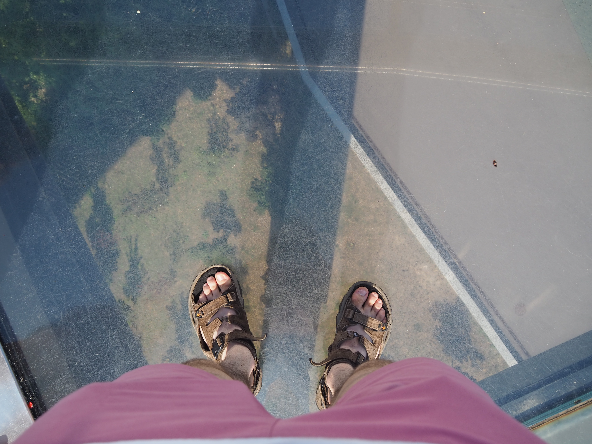

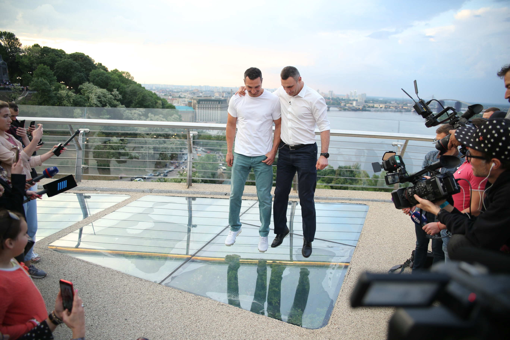

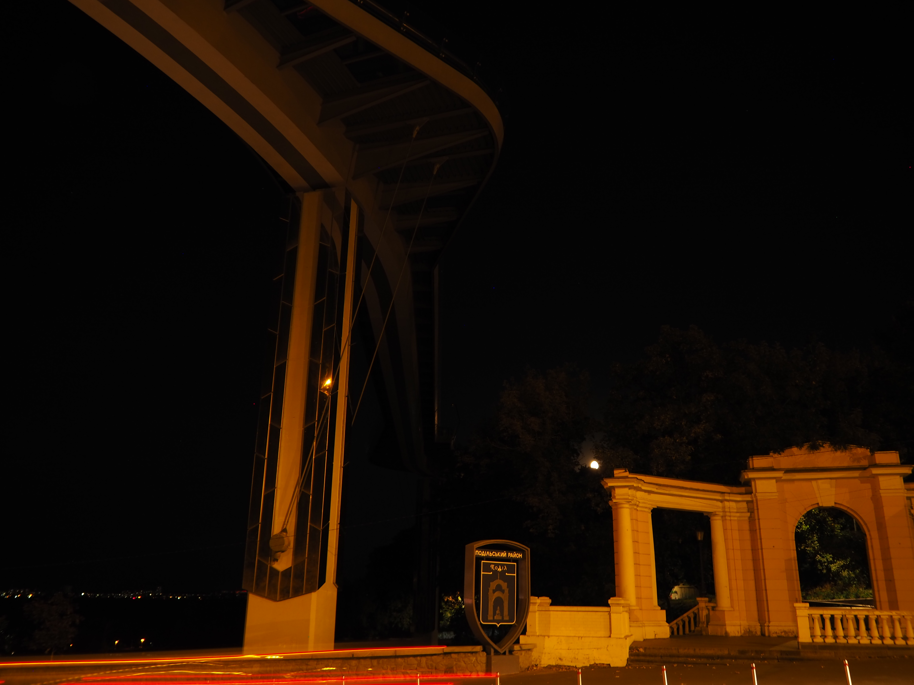

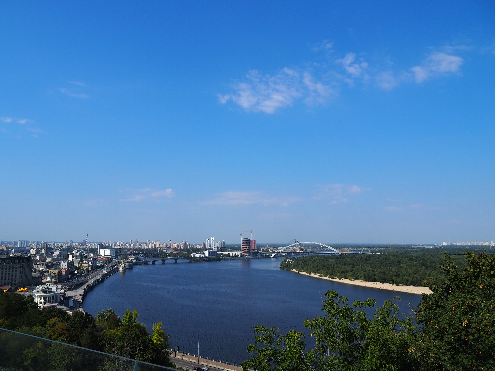

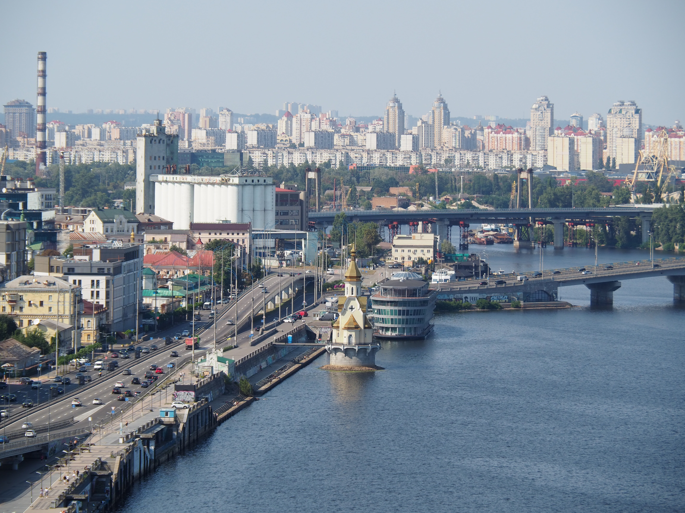

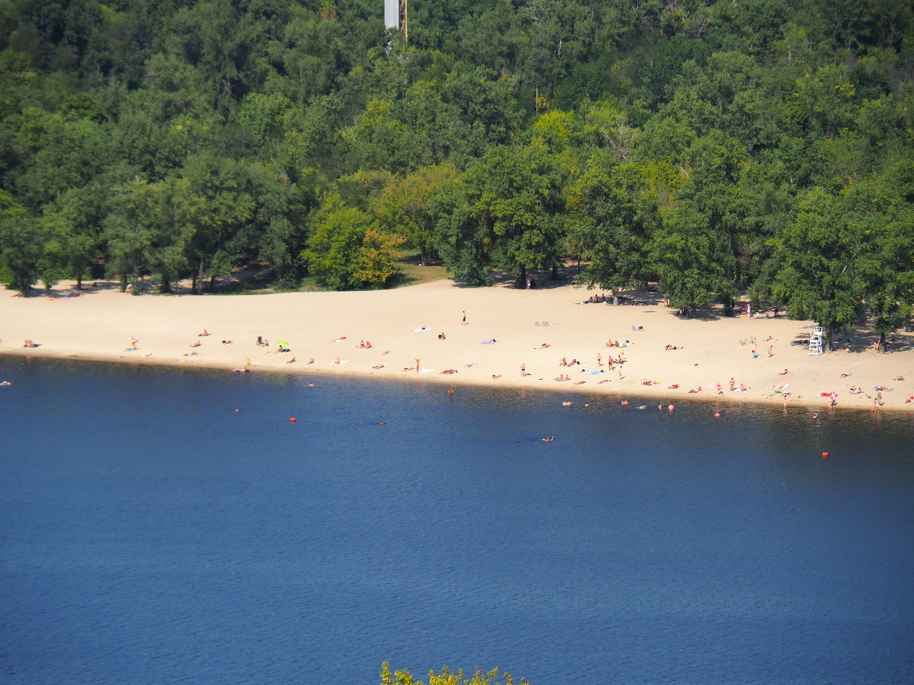

Après le pont, il y a un parc avec une fontaine et une statue de
[Saint Volodymyr](https://fr.wikipedia.org/wiki/Vladimir_Ier) qui se convertit
au christianisme.

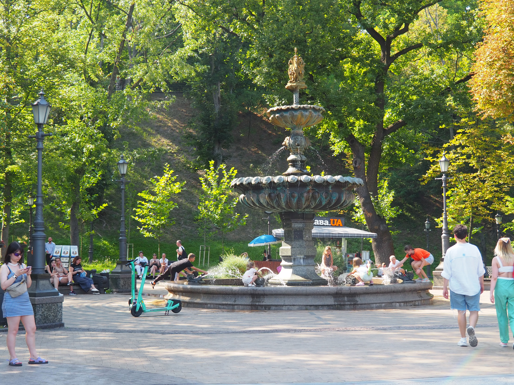

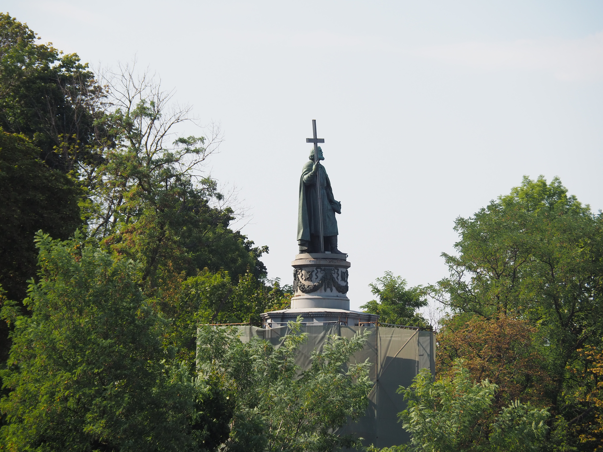

[Page suivante : Hidropark](kyiv_2_hidropark.md)
