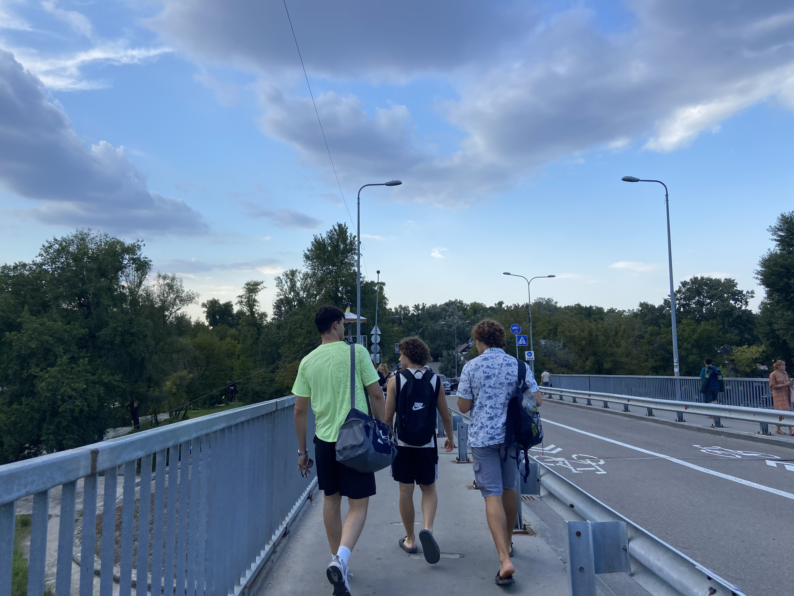

# Le métro

Après ce jour-ci, comme il faut très chaud, on rejoint le cousin de Vova et un
ami à lui se baigner a Hidropark, un complexe de loisir incluant des plages sur
le Dnipro.

Pour se faire, on prend le métro. Le métro est assez particulier à Kyiv. Il n'y
a que trois lignes, mais elles sont très longues. Les trains sont aussi plus
gros, c'est presque plus proche du RER à Paris.

Le photos ci-dessous ne sont pas toutes de cette après, ni toutes de la même lignes.

Selon les stations, il est par endroit très profond (surtout en centre-ville),
la station la plus profonde est la deuxième plus profonde au monde, avec 102
mètres sous terre.

# Hidropark

Hidropark est sur des iles du Dnipro, il faut donc en traverser un bras. Le
métro qui traverse le Dnipro est un métro aérien, on peut donc admirer la
traversée.

Évidemment, dès qu'on est arrivés, le ciel commence à se couvrir.

## Le parc de musculation

À Hidropark, il y a aussi une sorte de salle de musculation en plein air très
étonnante. Il existe de l'équipement sportif en plein en France, mais il s'agit
en général de barre de tractions, il n'y a jamais de poids à soulever. Le parc
de musculation d'Hidropark à lui énormément de machines à soulever des poids, et
des bancs pour le développé couché ou autre exercice. L'équipement à été
construit par des volontaire avec du matériel industriel de récupération, à
partir de la fin des années 60. Vous pouvez en lire un peu plus
[ici](https://apnews.com/general-news-683274437618435bb03b869b617d93c5), mais
les informations ne sont pas faciles à trouver en anglais.

Il y a des machine parfois assez complexes.

Il y a une corde à grimper.

