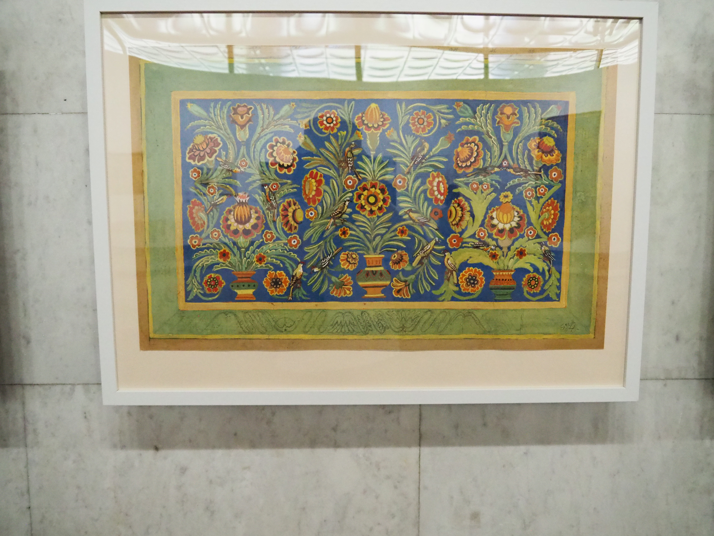
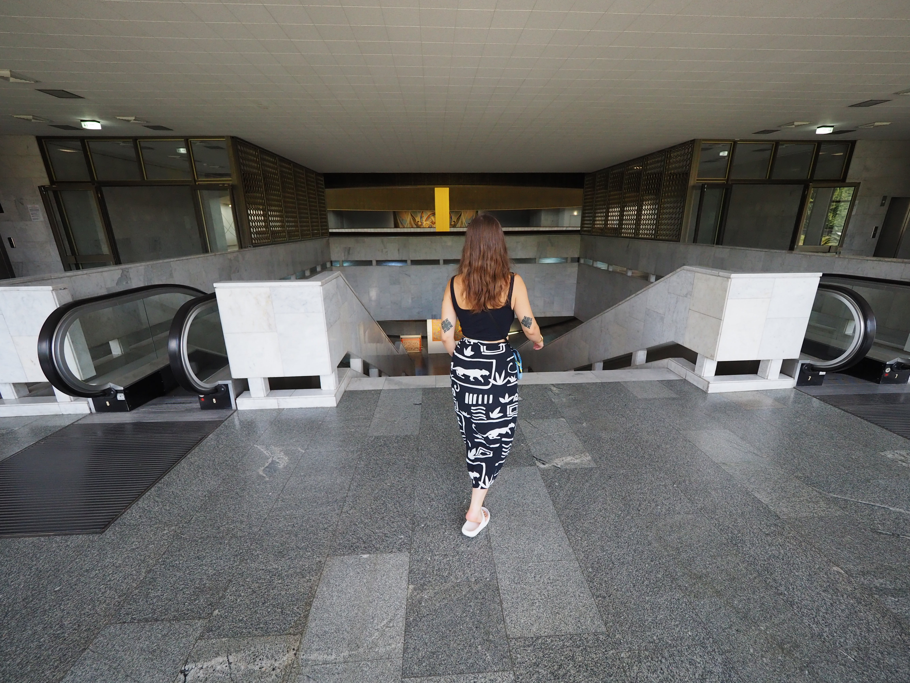

# Materiya

Entre Maïdane et l'Arche des nations, se situe la Maison de l'Ukraine. Il s'agit
d'un centre d'exposition, anciennement le musée Lénine de Kyiv. C'est un
bâtiment à plusieurs étages, avec un grand trou qui les traverse, ce qui
permettait à l'énorme statue de Lénine de ne pas rayer le plafond. L'oncle
d'Antonina nous a raconté que la statue de Lénine a été sortie en hélicoptère
par le toit, mais je n'ai pas trouvé de photo de l’événement.

Antonina a fait un stage à l'ONG [Ukraine Crisis Media Center.](https://uacrisis.org/fr/),
centre des médias qui a ses bureaux ici, lors de son année de césure.

Lors de notre voyage, une exposition sur les textiles ukrainiens y a eu lieu.

Malheureusement, beaucoup de photos incluent un écriteau, mais très légèrement trop
flou pour être lu. J'essaye d'inclure les information lorsque j'arrive à les
déchiffrer.

L'exposition est super, il a beaucoup de très belles tapisseries.

## En bas

).](images/kyiv/p2/exposition_materiya/tapis_deux_trembita.jpg)

## Milieu

Il y a une pièce avec des costumes réalisée par [Lioudmila
Semykina](https://fr.wikipedia.org/wiki/Lioudmila_Semykina), une artiste
Ukrainienne importante, et opposante dans les années 60.

## En haut

On arrive au dernier étage, il y a une seule tapisserie ici, mais c'est la plus
grande.

On prend aussi beaucoup de photos du bâtiment lui-même.

[Page suivante : l'Arche de la liberté du peuple Ukrainien](kyiv_2_arche.md)
