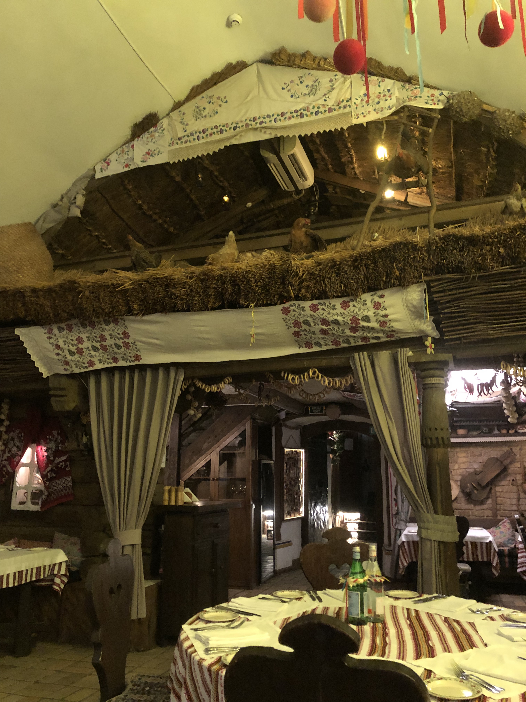
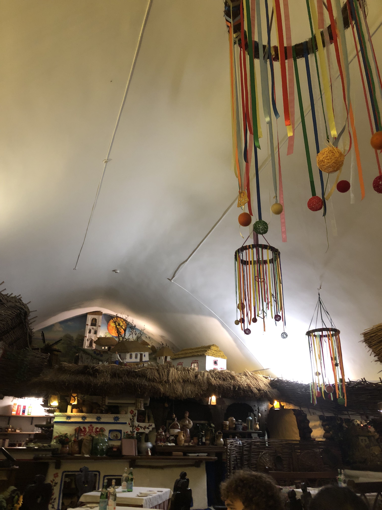
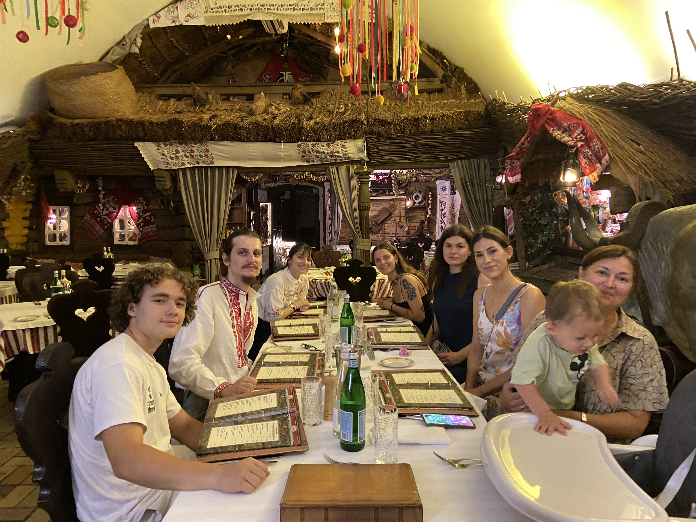
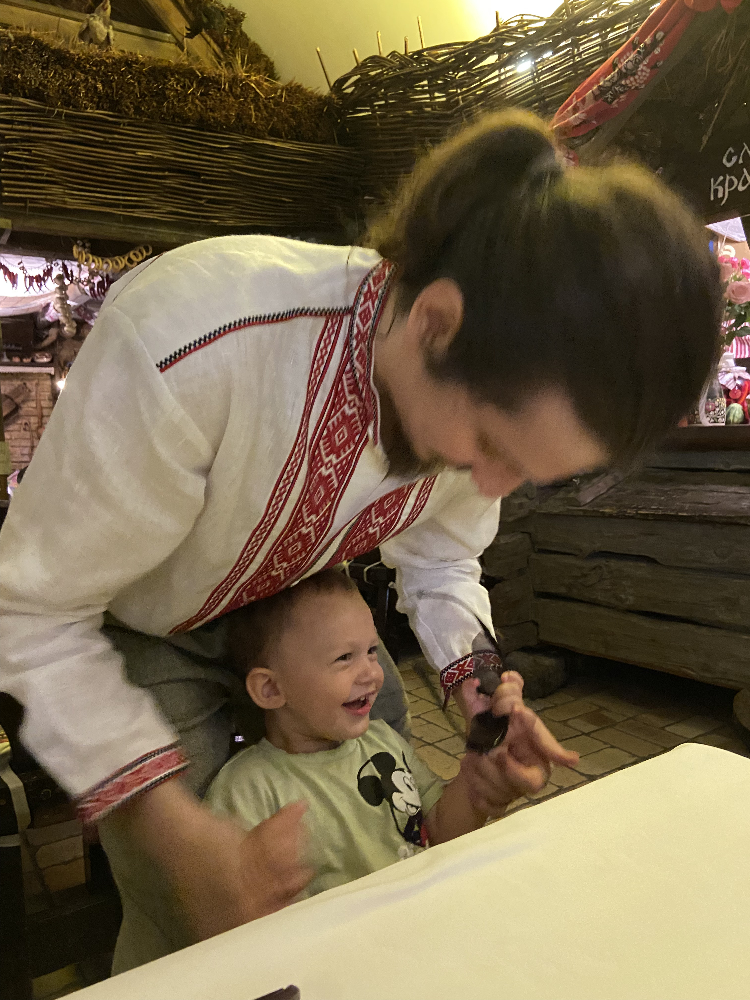
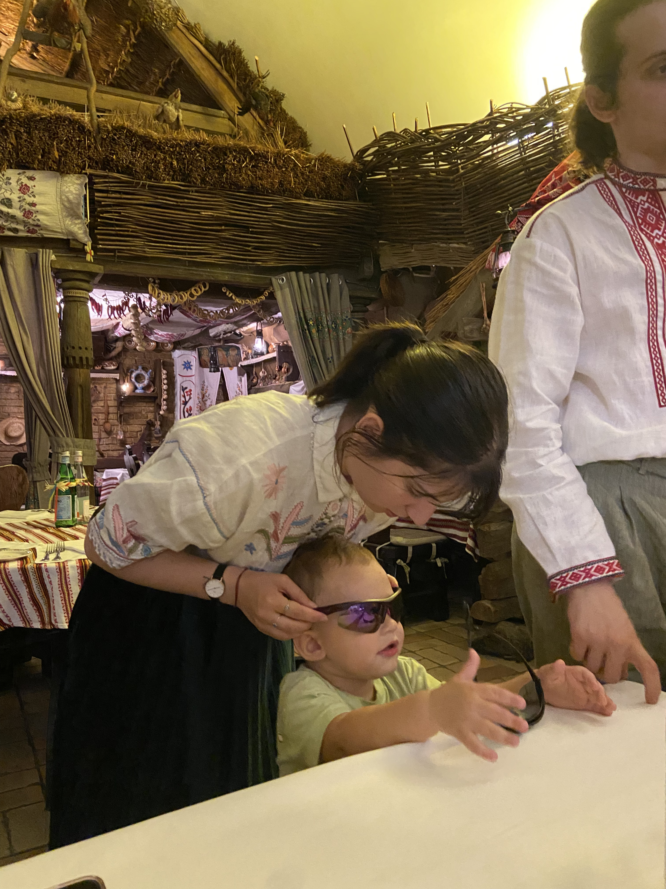
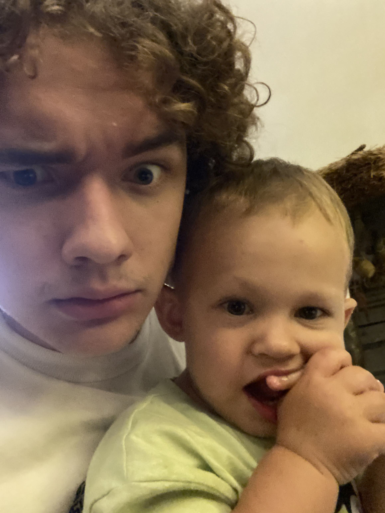
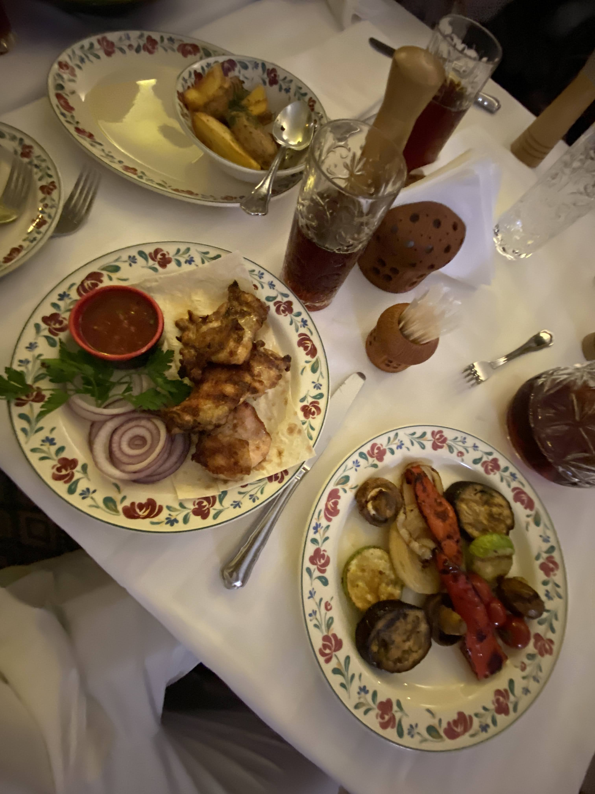
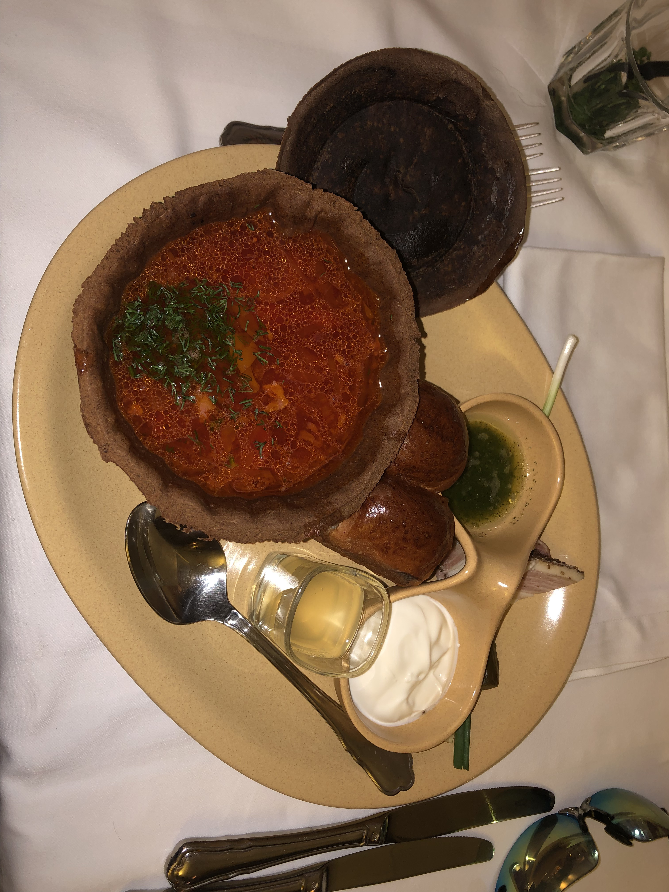

# Tsarske Selo

Après cet après-midi de visites, Antonina nous retrouve pour manger avec ses
cousins au restaurant. Comme ils n'ont pas pu venir à notre mariage en France,
c'est un aussi une manière de le célébrer avec eux.

Le restaurant que l'on a choisi est Tsarske Selo, le "village royal". C'est un
restaurant auquel on est allés avec Antonina en 2021 et 2023, dans un style très
traditionnel ukrainien, avec un décor campagnard.

[Page suivante : Sophie et Michel](kyiv_4_sophie_et_michel.md)