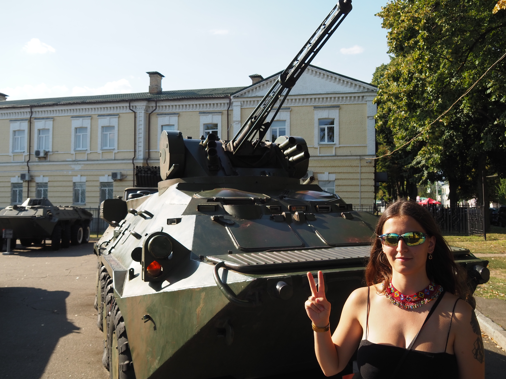
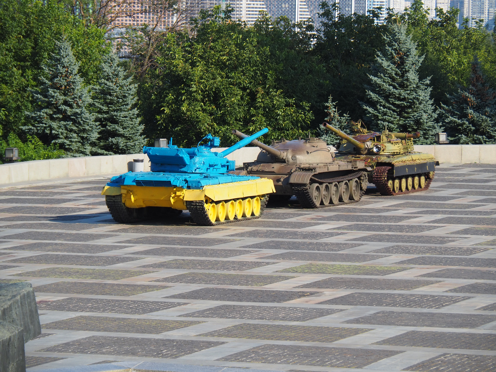
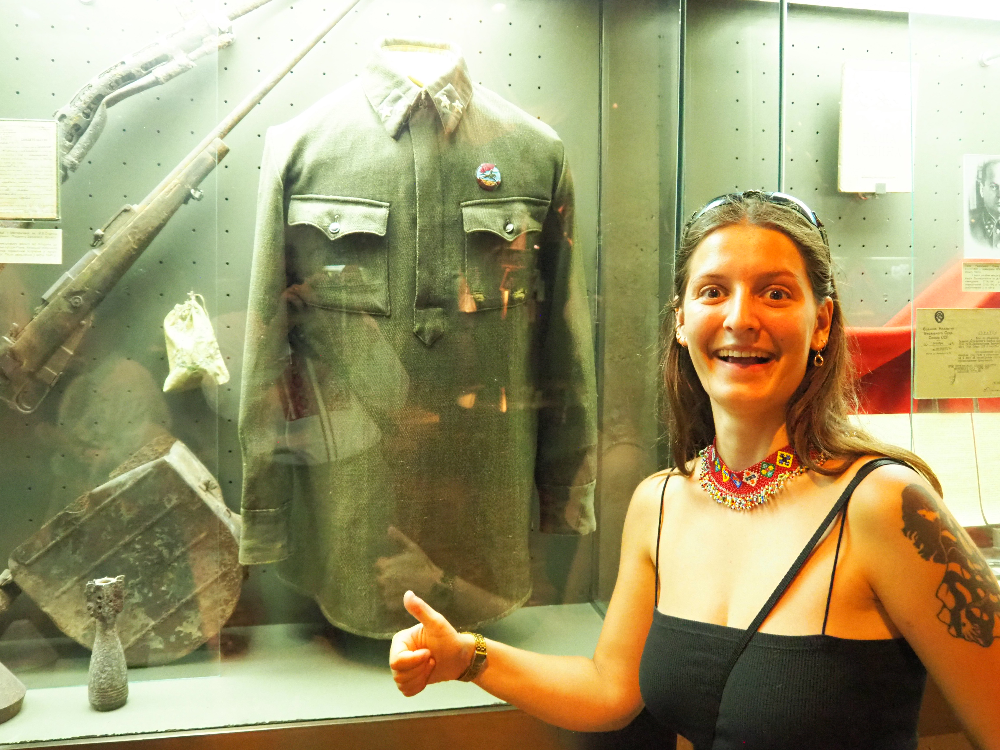
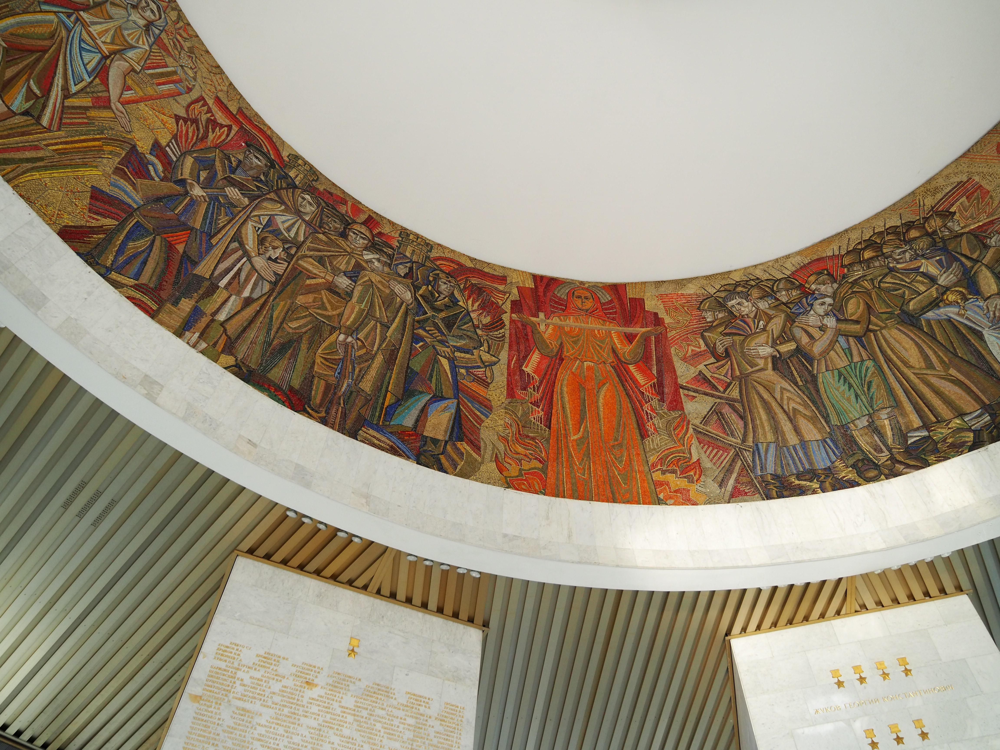

# La statue la mère Ukraine

À Kyiv se situe la statue de la mère Ukraine. Il s'agit d'une gigantesque statue
de femme de 64 mètres de haut, sur un socle de 40 mètres. Elle a été construite
à l'époque soviétique pour commémorer la Seconde Guerre Mondiale et s'appelait
alors la statue de la Mère Patrie.

En 2023, des travaux étaient en cours, et on ne pouvait pas la voir de près.
Cette année, j'y emmène Vova, Coline et Alice sans savoir si on pourra
s'approcher, ou visiter le musée à son pied. Antonina reste se reposer à
l'appartement.

Pas loin de la statue se situe une exposition en plein air avec des véhicules de
la guerre du Donbass, tous d'avant l'invasion à grande échelle.

Cette fois-ci, on peut s'approcher plus de la statue !

## Le musée

Sous la statue se situe un grand musée. Je l'avais visité avec Antonina en 2021 :
il contenait une exposition très kitsch sur la Seconde Guerre Mondiale, et une
sur la guerre dans le Donbass. En 2023, on n'avait pas pu y retourner, mais
cette fois le musée est ouvert.

### Le rez-de-chaussée

Au rez-de-chaussée du musée il y a une exposition temporaire sur les jeux
olympiques, et les conséquences de la guerre sur la participation de l'Ukraine.

Dans une petite salle se trouve une exposition des uniformes des chapelains de l'armée ukrainienne.

### L'exposition Seconde Guerre Mondiale

Toujours au rez-de-chaussée, cette exposition est dans un esprit très soviétique
de propagande. Beaucoup de choses y sont présentés de manière très dramatique et
sensationnelle, mais pas forcément de la manière la plus informative possible.

Le [ruban de Saint-George](https://fr.wikipedia.org/wiki/Ruban_de_Saint-Georges)
est un symbole [datant de l'Empire
Russe](https://fr.wikipedia.org/wiki/Ordre_imp%C3%A9rial_et_militaire_de_Saint-Georges),
présent dans plusieurs décorations militaires russes, notamment [pour la Seconde
Guerre Mondiale](https://fr.wikipedia.org/wiki/Ordre_de_la_Gloire) Il est
 aujourd'hui très utilisé dans le cadre du culte de la victoire en Russie, et il
est interdit en Ukraine de le cadre des [lois de
décommunisation](https://fr.wikipedia.org/wiki/D%C3%A9communisation_en_Ukraine),
qui ne s'appliquent pas aux monuments dédiés à la Seconde Guerre Mondiale.

L'exposition seconde guerre a une petite annexe au deuxième étage.

### Deuxième étage : les drones

Au deuxième étage, peu de choses sont exposées car le gros de la surface est
occupé par l'exposition temporaire qui n'est pas encore ouverte. Il y a tout de
même une exposition de drones russes abattus.

L'inscription dit "Pour le pont et pour les Belgorodiens". Le pont fait
référence au pont de Kerch construit illégalement qui relie la Crimée occupée
avec la Russie et que l'armée ukrainienne a attaqué
[deux](https://en.wikipedia.org/wiki/2022_Crimean_Bridge_explosion)
[fois](https://en.wikipedia.org/wiki/2023_Crimean_Bridge_explosion).

Belgorod est une ville russe proche de la frontière avec l'Ukraine. Ses habitants
souffrent donc de la guerre, et sont parfois [bombardés par leur propre armée de
l'air](https://en.wikipedia.org/wiki/2023_Belgorod_accidental_bombing).

. Il s'agit d'un drone ayant une portée entre 40 et 70 kilomètres, très utilisé par les Russes pour frapper l'artillerie ukrainienne. Il s'écrase sur sa cible.](images/kyiv/p3/mere_patrie/drones/lancet.jpg)

. C'est un drone russe de reconnaissance, non armé. Il a été peint par des Ukrainiens après sa capture.](images/kyiv/p3/mere_patrie/drones/orlan.jpg)

Dans la même pièce il y a aussi des photos des travaux de 2023, lorsque les
armoiries soviétiques on été retirées du bouclier de la statue pour y mettre un
trident ukrainien.

### Troisième étage : le socle

À l'étage suivant, qui est le socle de la statue, il y a une très belle
et très soviétique mosaïque.

Une fois cela fait, on veut aller prendre des photos depuis le pied du socle de
la statue, mais on nous interdit de sortir par la porte de l’intérieur du
socle, qui est pourtant ouverte.

On redescend donc jusqu'au rez-de-chaussée puis on prend des escaliers pour
monter jusqu'au socle.

Depuis le bas du socle, on a une très belle vue sur Kyiv.

.](images/kyiv/p3/mere_patrie/eglise_dore.jpg)

On prend aussi des photos de nous :

En 2021, on avait pu monter sur les tanks devant la statue. Comme cette fois-ci
il n'y a personne d'autre qui le fait, j'insiste pour que Vova demande la
permission, que l'ont obtient.

On se dirige ensuite vers la sortie en empruntant un tunnel dans lequel il y a des statues.

Une fois sortis, on va voir une autre exposition en plein air de materiel militaire.

Après toutes ces visites, on retrouve la famille d'Antonina pour un repas au restaurant.

[Page : ]
