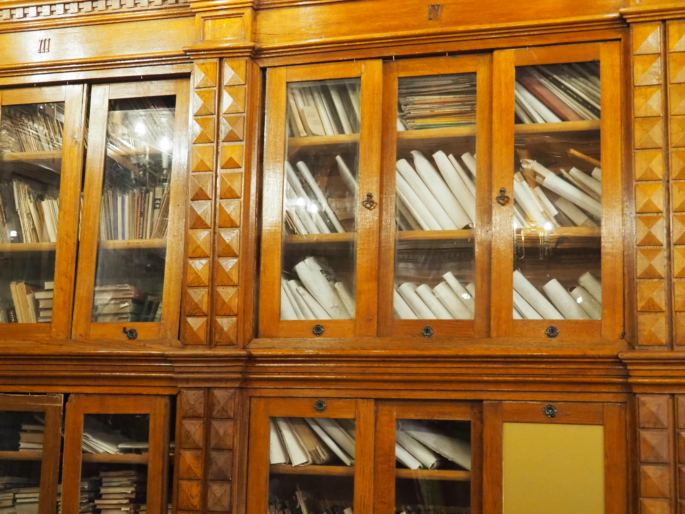

# Le musée de la littérature

Après cela, tout le monde était trop fatigué et voulait se rendre à
l'appartement, mais Coline et moi avions encore envie de visiter quelque chose.
Antonina nous indique un musée de l'histoire de Kyiv, on s'y rend mais il est
fermé.

On regarde alors sur Google Maps quel est le musée ouvert le plus proche : c'est
le musée national de la littérature.

Il se situe dans un batiment néoclassique. Les collections ont l'air de n'avoir
pas bougées depuis la construction du musée. Ne sachant pas parler Ukrainien, la
litterature n'est pas le sujet le plus interessant.

Il y a plusieurs livres anciens, probablement en Slavon puisque l'on voit la
lettre [Yus](https://en.wikipedia.org/wiki/Yus), qui n'existe pas en Ukrainien
moderne, ni dans la plupart des langues slaves.

Un peu plus loin, il y a une petite bibliothèque.

Il y a aussi un certain nombre d'oeuvres d'art et tableaux, notamment un
autoportrait de Taras Chevtchenko qui est reproduit sur le billet de 100&nbsp;hryvnias.

_Maroussia_ est un livre de littérature jeunesse écrit par l'écrivaine
ukrainienne Maria Vilinska, sous le pseudonyme masculin Marko Vovtchok. Il est
ensuite traduit et adapté par l'éditeur français de Jules Verne [Pierre-Jules
Hetzel](https://fr.wikipedia.org/wiki/Pierre-Jules_Hetzel). Celui-ci le publie
sous son pseudonyme d'écrivain, P.J Stahl, avec tout de même la mention "d'après
une légende de Markovovtchok". Il s'agit d'un roman patriotique, qui raconte
l'histoire d'une jeune ukrainienne, Maroussia, qui habite dans une Ukraine qui
essaye de se libérer de la domination polonaise sans tomber dans le piège russe.

Il rencontre un très grand succès en France, aussi bien commercial que critique.
Il reçoit les éloges de Jules Verne et Flaubert, ainsi qu'un prix de l'Académie
française.

La publication de _Maroussia_ sous le nom de P.J Stahl et non Marko Vovtchok
suscite des controverses qui sont détaillées dans [l'article
Wikipedia](https://fr.wikipedia.org/wiki/Maroussia)

Après toutes ces visites, on rentre dormir à l'appartement.

[Page suivante : l'hôtel Ukraine](kyiv_5_hotel_ukraine.md)
