# Le musée de la méduse

Après une visite de Podil sous la canicule, on cherche une visite en intérieur.
Depuis mon premier voyage en Ukraine, j'ai été intrigué de voir un bâtiment avec
écrit "musée de la méduse" sur Maïdane, la très importante place de
l'indépendance.

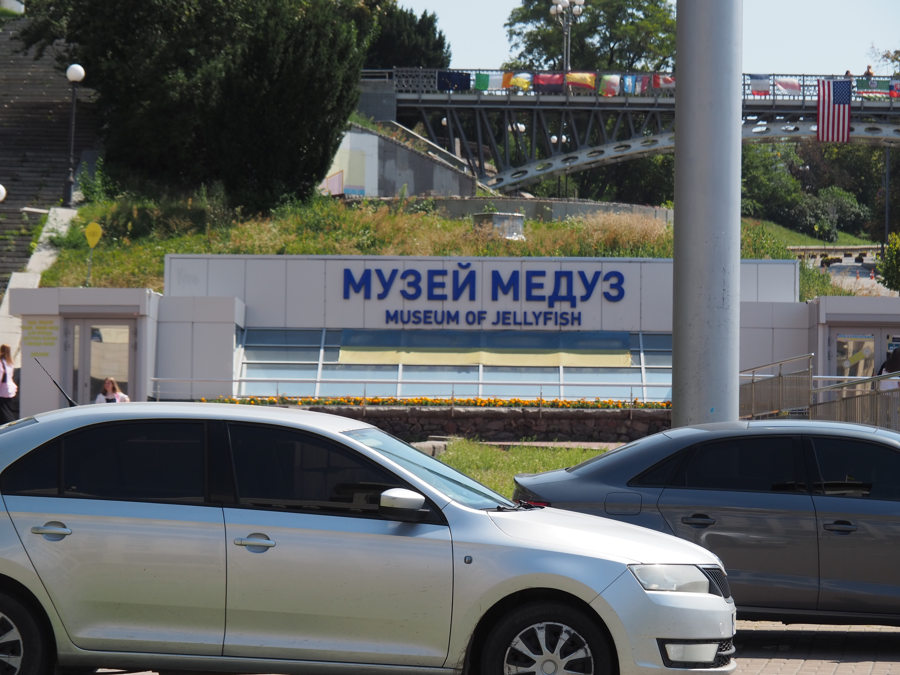

On décide donc d'y rentrer, et il s'agit effectivement d'un musée de la méduse.
Il y a des aquariums avec plein de méduses différentes éclairées par de la
lumière colorée.

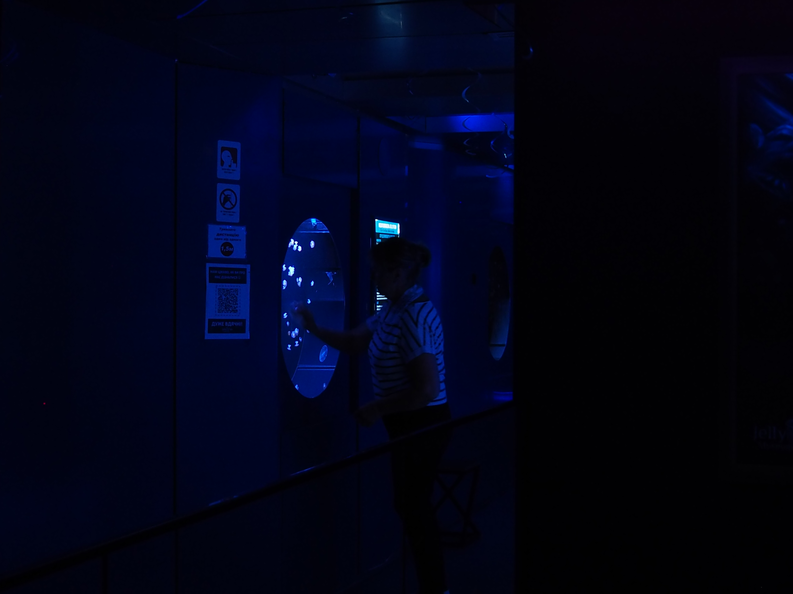

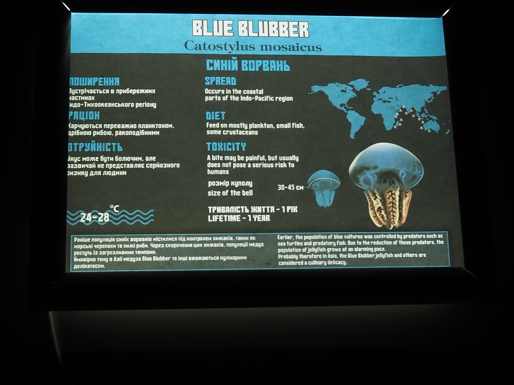

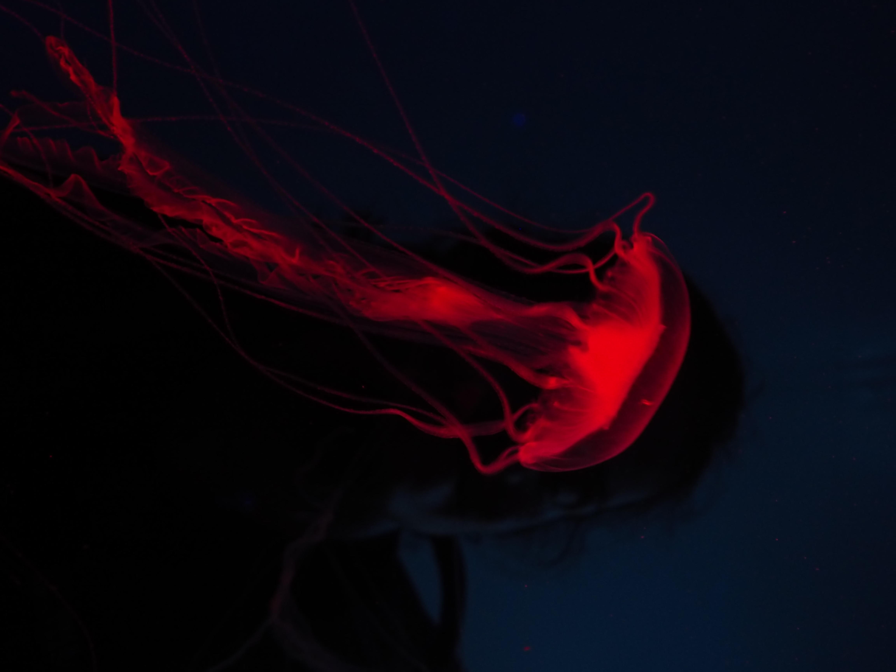

Et bien sur, il y a plein de méduses :

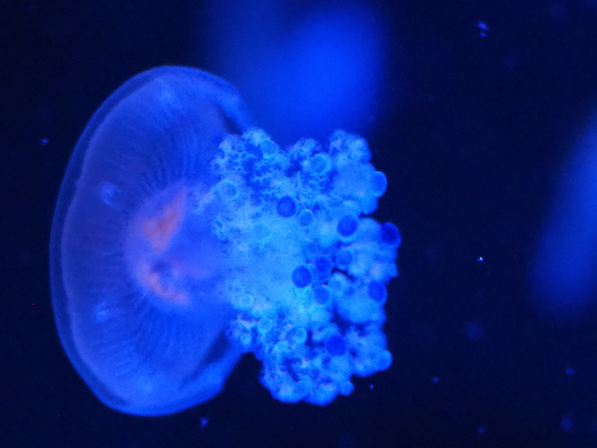

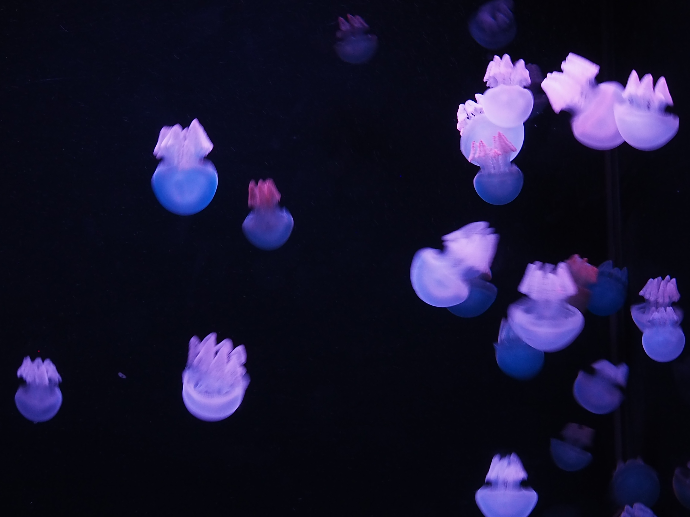

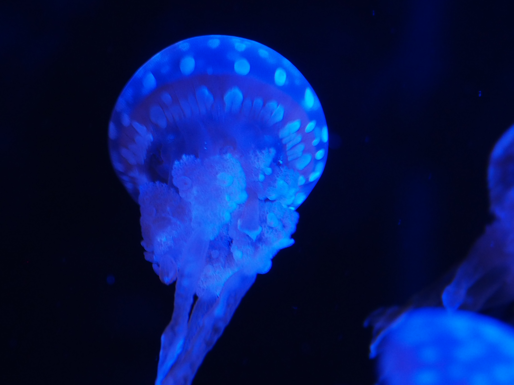

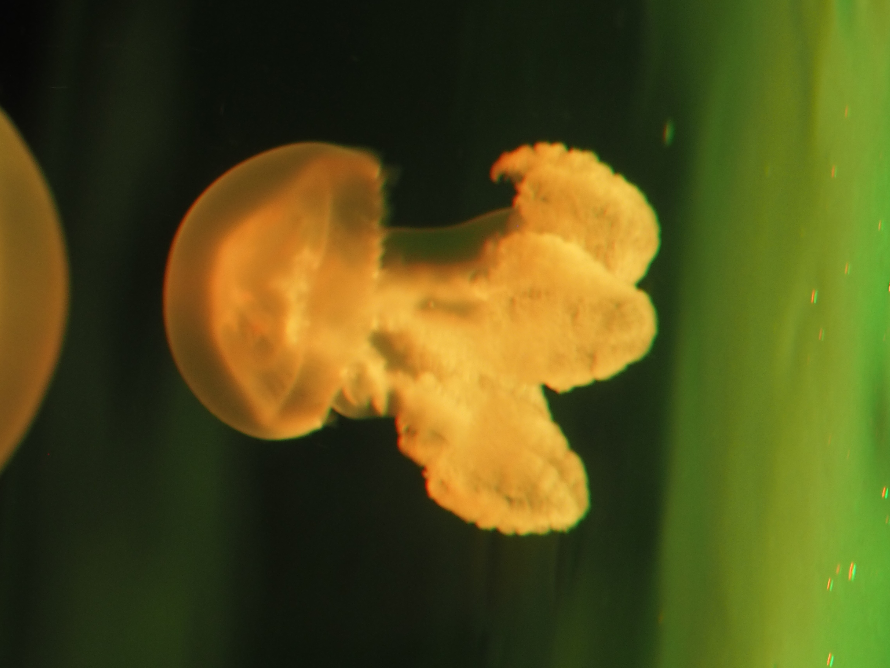

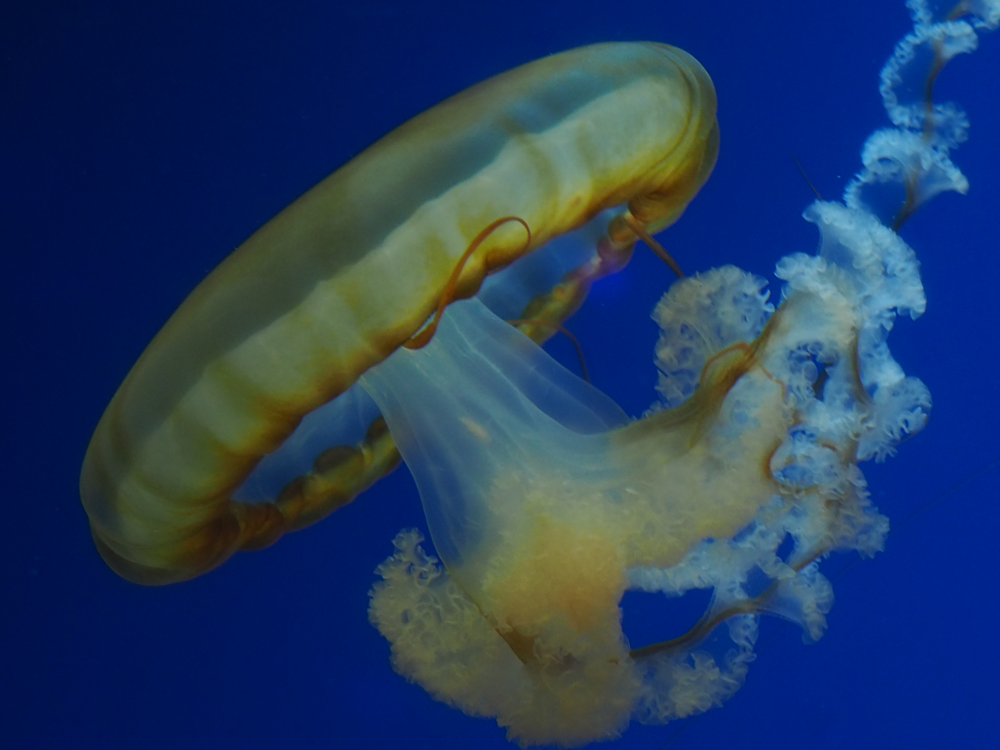

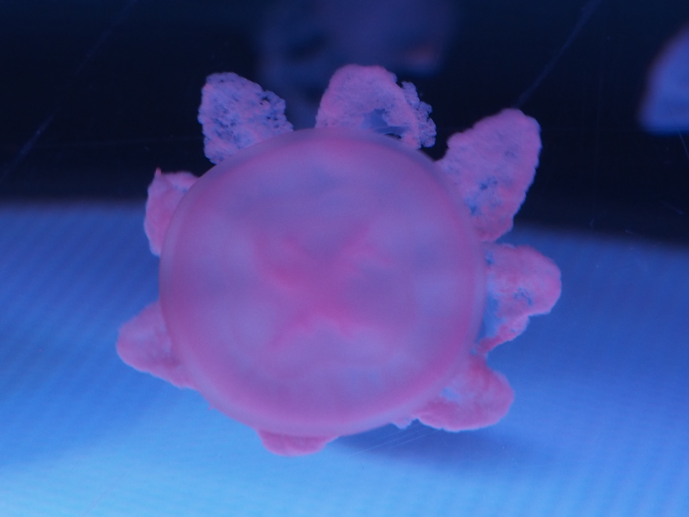

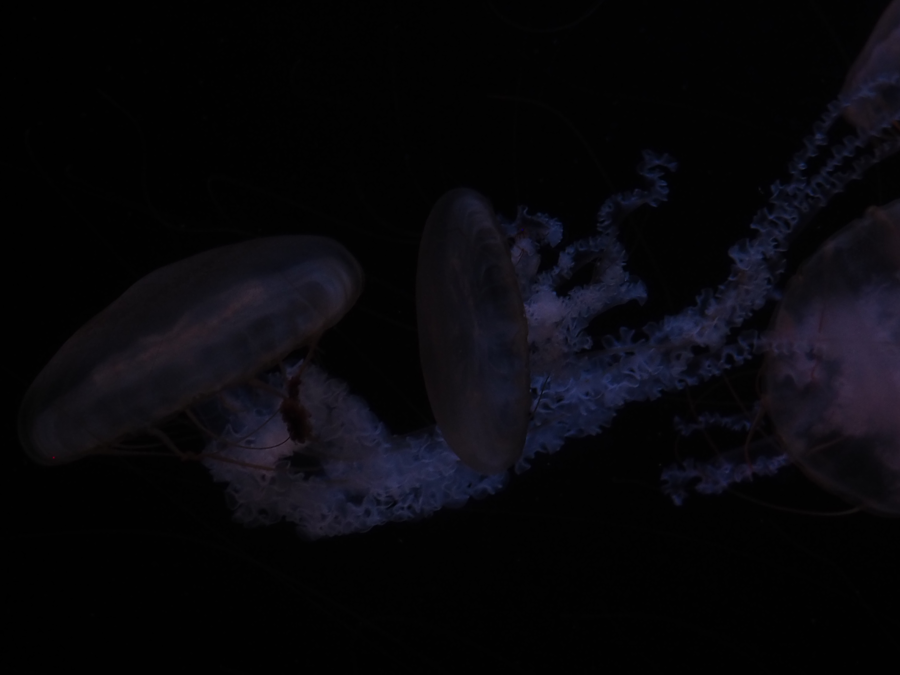

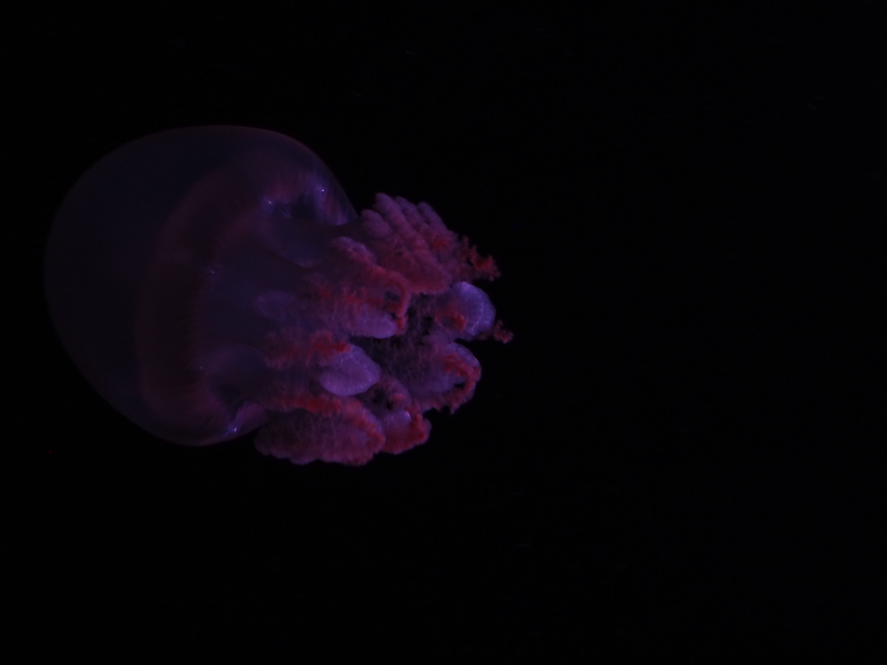

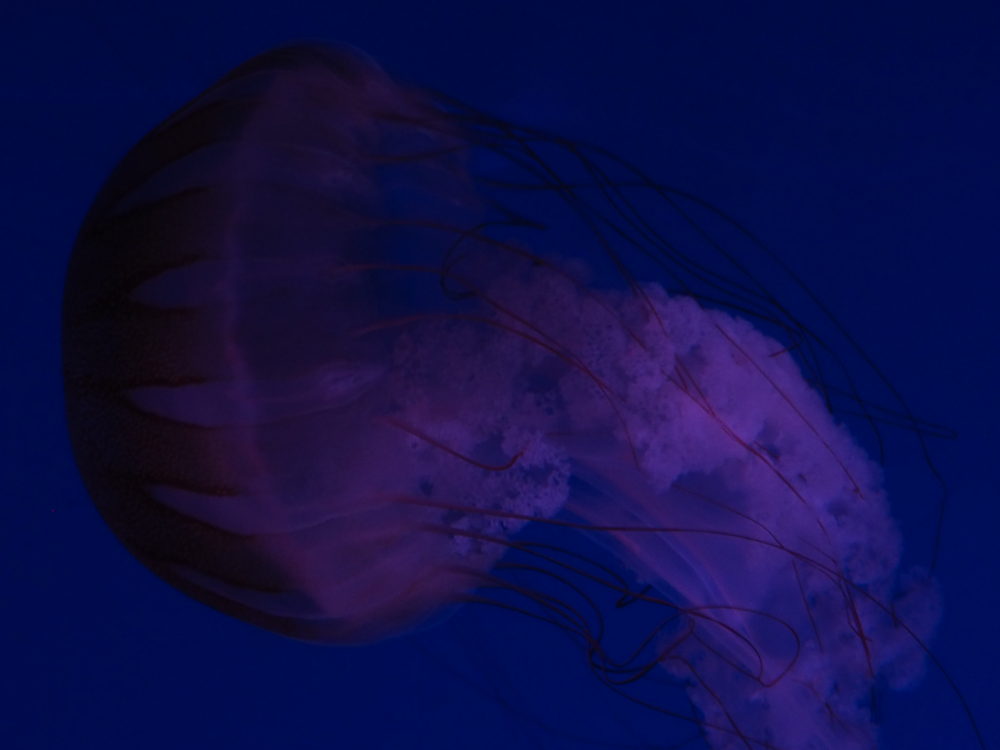