# Podil

Une fois en bas de Saint-André, on arrive à Podil, un quartier historique de
Kyiv ou beaucoup de bâtiments et le tracé des rues datent du XIXieme siècle.

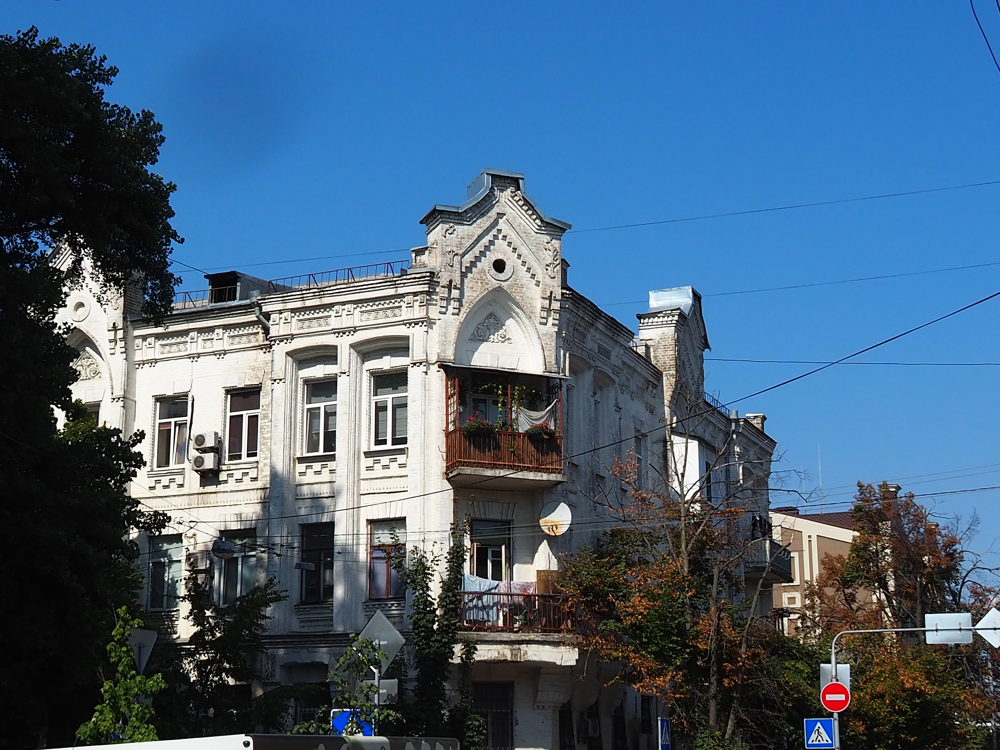

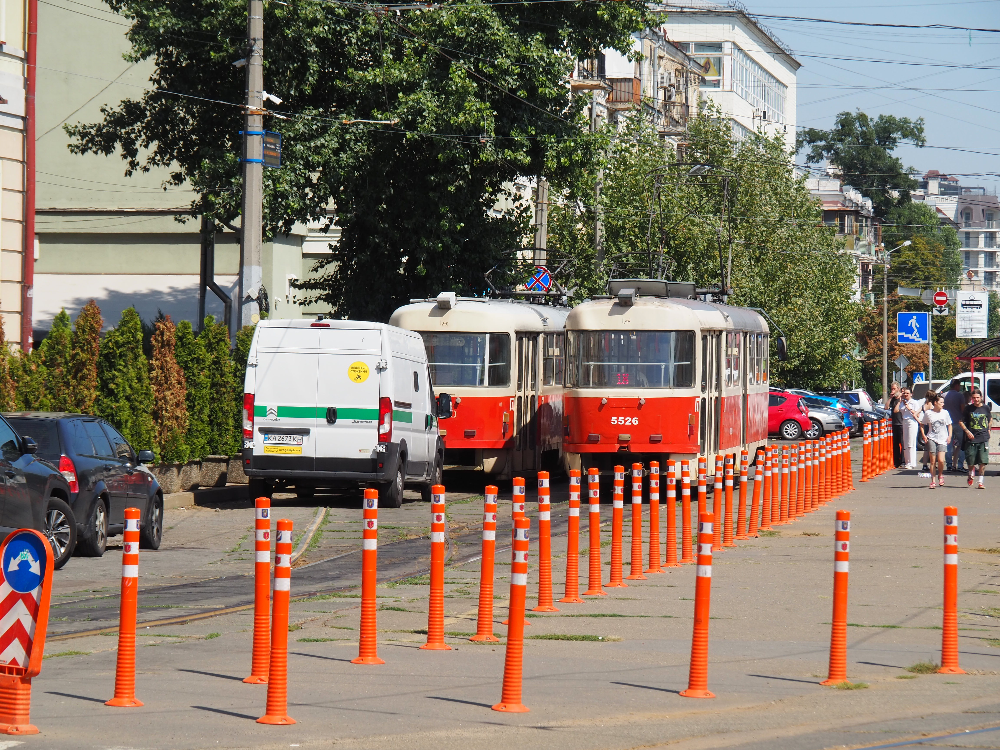

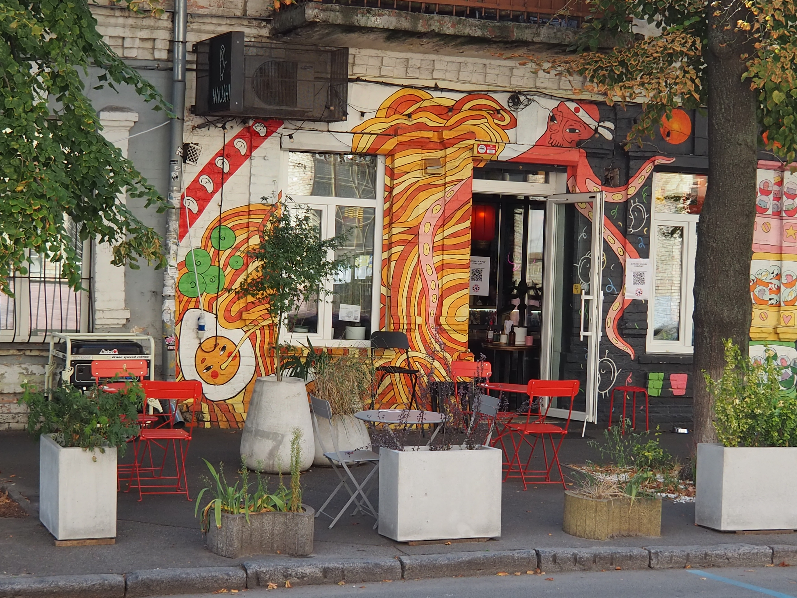

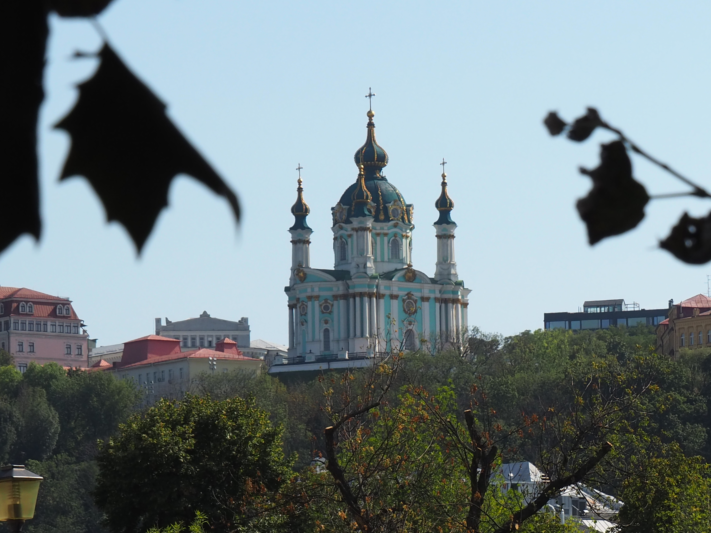

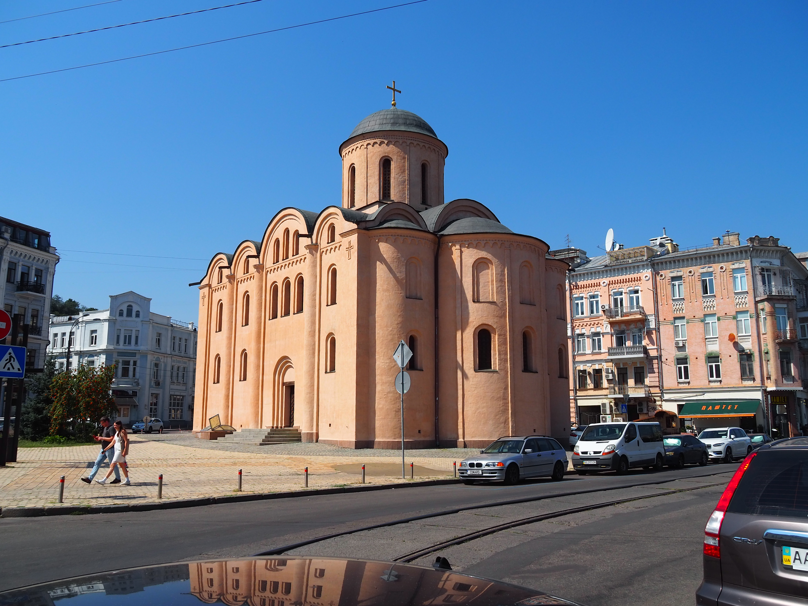

L'église Pyrohochtcha me tape dans l'oeil car c'est une des seules églises que
l'on croise à ne pas etre en style baroque. En réalité, comme toute les églises
anciennes de Kyiv, des décorations baroques lui ont été ajouté au XVIIIième
siècle. Cependant, le pouvoir soviétique la détruit en 1935, et elle est
reconstruite en 1998, dans un style plus ancien, que je trouve de meilleur gout,
mais dont l'authenticité est discutée.

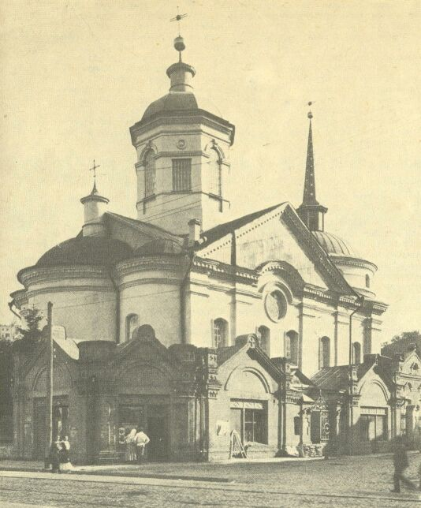

Il y a aussi plusieurs fresques :

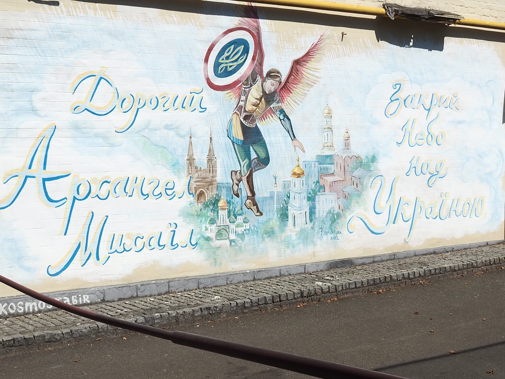

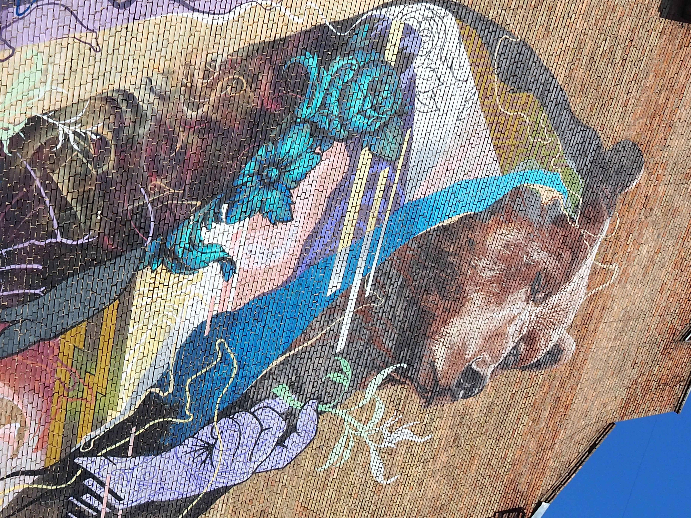

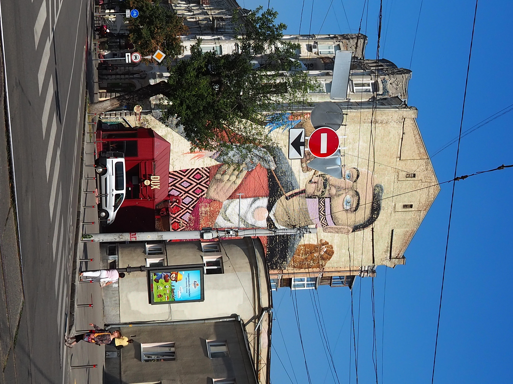

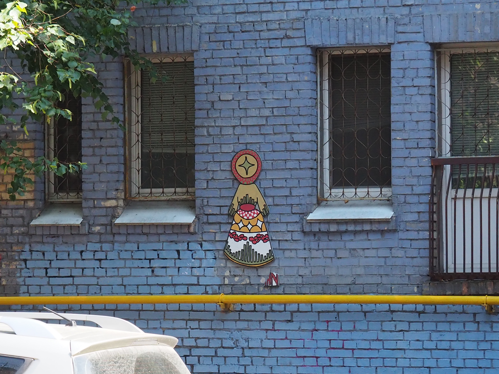

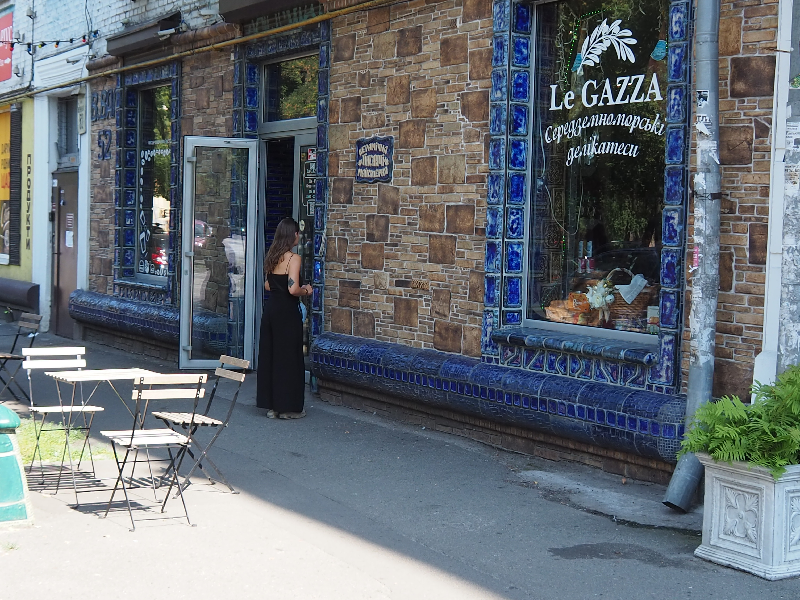

On rentre dans un magasin de chemise brodé ukrainiennes (vichivannka) de la
marque [etnodim](https://etnodim.com/). Antonina et moi sommes très fan de cette
marque, mais cette fois on achètera rien.

On marche ensuite le long du Dnipro, qu'on ne peut pas voir à cause de l'immense rocade que l'on peut voir sur les photos depuis Saint André.

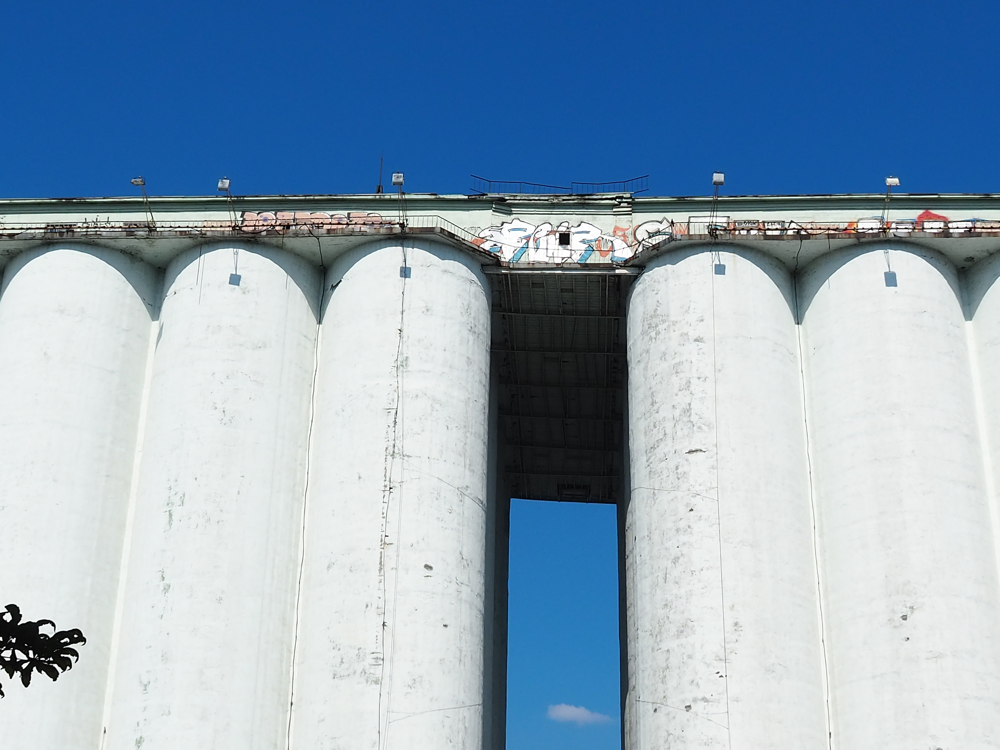

[Page suivante : le musée de la méduse](kyiv_4_musee_meduse.md)
