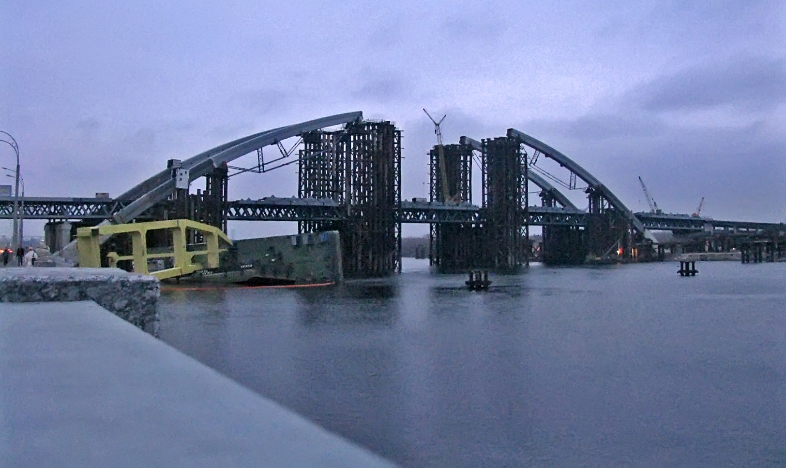

# Saint André

Après Saint-Michel, on se dirige vers l'église Saint-André et la descente
éponyme.

L'église est un petite église baroque, très décorée, construite en 1744 par un
architecte italien.

Elle se situe sur le sommet d'une colline ; on profite de la vue.

On voit aussi le fameux "Pont Orelsan" lieu du tournage de [_Basique_](https://www.youtube.com/watch?v=2bjk26RwjyU)

Son vrai nom est le [pont
Podilskyi](https://fr.wikipedia.org/wiki/Pont_Podilskyi). Sa construction
mouvementée est encore en cours, mais certaines voies sont ouvertes depuis 2023.

Coline nous prend en photo avec la vue.

On rentre dans l'église.

## La descente

Ensuite, on prend la descente Saint-André, une rue très en pente sur laquelle on
espérait trouver un grand nombre de marchants de souvenirs. Malheureusement, il
n'y a quasiment personne ce jour-ci, peut-être à cause de la chaleur.

Cette rue est aussi le lieu de cette [vidéo
célèbre](https://www.youtube.com/watch?v=qHje5AhgV6E) d'une petite fille qui
n'arrive pas à monter à cause du verglas pendant l'hiver.

La maison de [Mikhail Boulgakov](https://fr.wikipedia.org/wiki/Mikha%C3%AFl_Boulgakov)
se situe aussi ici.

On arrive ensuite dans le quartier de Podil.

[Page suivante : Podil](kyiv_4_podil.md)
