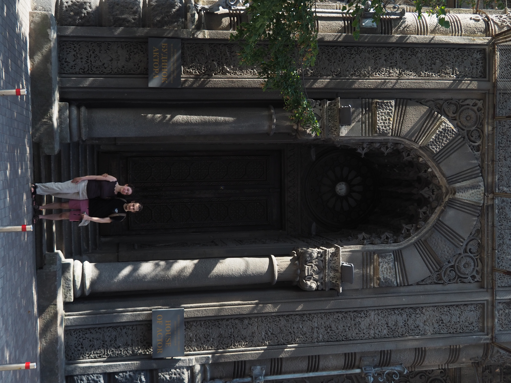

# Sophie et Michel

Le lendemain, on décide de se balader dans Kyiv, et de visiter la descente
Saint-André, où on espère acheter des souvenirs.

On passe voir ce qui se trouve sur le chemin, comme par exemple la [Porte
Dorée](https://fr.wikipedia.org/wiki/Porte_dor%C3%A9e_(Kiev)) :

La Porte Dorée est une porte des fortifications historique de Kyiv. Sa forme
actuelle est quasiment entièrement une reconstitution :

J'avais visité le musée qui est dedans en 2021, mais je n'en avais pas un
souvenir incroyable, alors on ne le fera pas cette fois.

On passe devant la Maison des acteurs. Les parents d'Antonina aiment beaucoup se
prendre en photo devant, alors on perpétue la tradition.

On arrive ensuite devant les églises Sainte-Sophie et Saint-Michel.

Ces deux églises sont construites sur un modèle de monastère. L'église elle-même
est ceinte par un mur. Le clocher est séparé de l'église, et sert
de porte pour franchir le mur d'enceinte.

## Sainte-Sophie

On passe d'abord devant Sainte-Sophie, qui est l'église la plus iconique des
deux, mais dont la place est plus vide.

## Saint-Michel

 sur la place Saint-Michel. Il est écrit sur le gilet "Nous protégeons ce qui est ukrainien".](images/kyiv/p4/sophie_et_michel/statue_gilet.jpg)

.](images/kyiv/p4/sophie_et_michel/centurie_celeste.jpg)

[Page suivante : Saint-André](kyiv_4_saint_andre.md)
