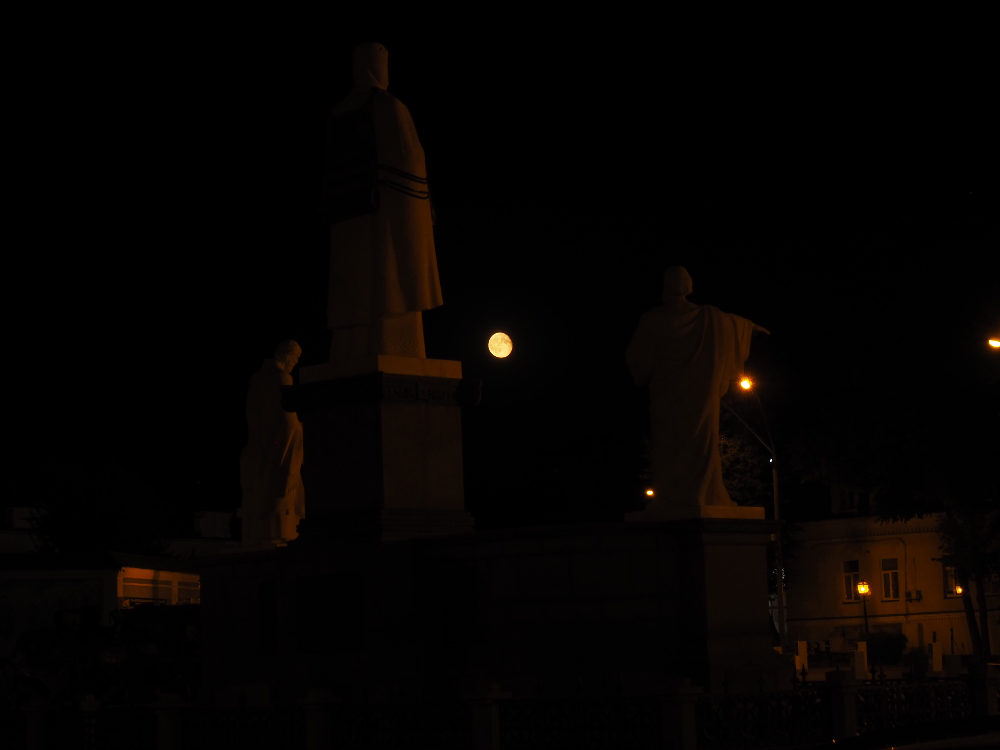

# Le départ d'Alice, Coline et Vova

Après VDNH, on part manger dans un restaurant assez classe où Antonina avait été
lors d'un déplacement professionnel.

C'est un restaurant fondé par Eugène Klopotenko, un chef ukrainien célèbre. On
avait assisté a un cours de cuisine du borche qu'il avait donné à Paris dans la
maison de l'Ukraine des Jeux Olympiques.

Il est devenu célèbre pour avoir gagné l'émission Master Chef Ukraine, avant de
lancer l'initiative pour classer le borche patrimoine culturel immatériel de
l'humanité de l'UNESCO. L'initiative aboutit en 2022.

C'est un restaurant de cuisine ukrainienne modernisée.

On rentre ensuite tous à l'hotel, Antonina et moi pour dormir et Alice, Coline
et Vova pour récupérer leurs valises avant de partir à la gare prendre le train
de nuit pour Lviv.

On passe par Saint-Michel éclairé par une Lune rousse.

À suivre : Kyiv à deux, puis Slavouta.