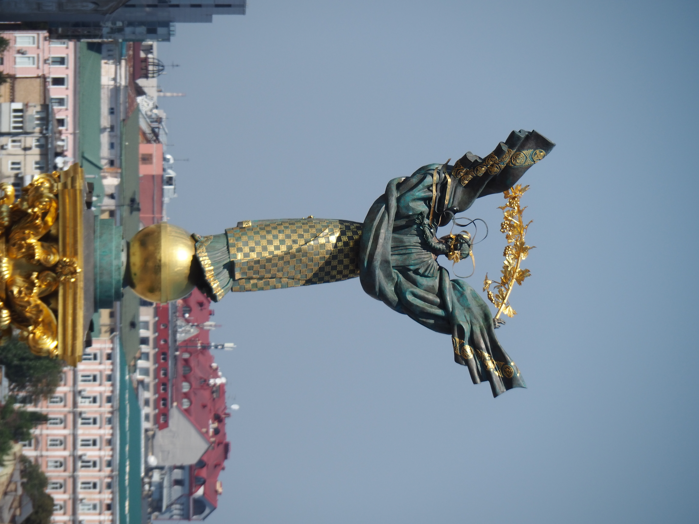

# L'hôtel Ukraine

Aujourd'hui, Vova, Alice et Coline prennent le train de nuit pour Lviv pour
rentrer en Pologne. Vova rentre parce que ses cours vont commencer, et Alice et
Coline vont visiter la Pologne. Comme on n'est plus que deux, on rend notre
grand appartement et on prend une chambre à l'hôtel Ukraine, sur Maïdane. Comme
les trains de nuit partent le soir, on monte tous dans la chambre pour stocker les
valises pendant la journée.

L'hôtel Ukraine est le grand hôtel soviétique de Kyiv, construit dans les années&nbsp;50. Il s'appelle alors hôtel Moscou, avant d’être renommé en 2001 pour les 10&nbsp;ans de l'indépendance. En 2014, lors de la révolution de la dignité son lobby
sert d’hôpital de fortune, et certains pensent que les snipers qui ont tiré sur la foule se
trouvaient sur son toit, sans qu'on en ai retrouvé la moindre preuve.

On avait vraiment envie d'y allé après avoir lu un [article dans le
Monde](https://www.lemonde.fr/m-le-mag/article/2024/05/24/l-hotel-ukraine-de-kiev-a-vendre-pour-financer-l-effort-de-guerre_6235125_4500055.html)
qui raconte son histoire, et qui explique qu'il rencontre de grandes difficultés
financières et risque d’être vendu.

On ressent le caractère soviétique vintage de l'hôtel.

On a un lit&nbsp;:

Un balcon :

Et une super vue sur Maïdane et sur Kyiv.

On prend des photos d'Alice.

On prend aussi de très belle photo au coucher du soleil.

Puis la nuit.

Certaines de ces photos sont prise dans les jours suivants le départ de mes
soeurs et de mon beau frère, je les groupe ici par thème.

