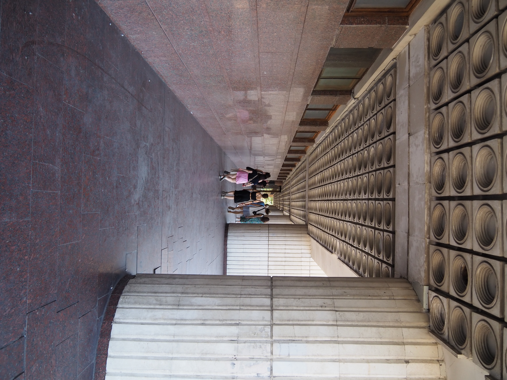

# Roshen et la Bibliothèque Nationale

Pour notre dernière journée, on souhaite se rendre au parc de VDNH. C'est un
parc assez loin sur la ligne bleue du métro. Officiellement, elle s'appelle
ligne M2, mais il est d'usage d'appeler les trois lignes par leur couleur,
rouge, bleue, et verte. À cause d'inondations en 2023, une station de ce métro
est fermée à la circulation et remplacée par un bus relais. On descend donc à
coté du grand centre commercial [Ocean
Plaza](https://en.wikipedia.org/wiki/Ocean_Plaza), on en profite aussi pour voir
la [soucoupe volante](https://publicdelivery.org/kiev-ufo/) une curiosité
architecturale.

Ensuite on prend le bus, jusqu'à la prochaine station de métro (ce n'est pas
comme à Paris, cela nous aurait pris une heure à pied).

À coté de cette station de métro se trouve l'usine de confiserie Roshen. Il
s'agit d'une très vieille usine de confiserie, construite en 1874. Sous l'URSS
elle est renommée Usine de confiserie Karl Marx, puis après avoir été privatisée
elle devient propriété de l'oligarque Porochenko qui la renomme selon sa marque
de confiserie éponyme : "Roshen".

Il devient président de l'Ukraine en 2014, puis revend Roshen en 2016.

## Roshen

Devant l'usine Roshen, une fontaine est installée, plusieurs enfants y jouent.

Il y a un magasin d'usine, ou l'on va acheter des confiseries. Le magasin est un
peu décevant, en tout cas Antonina ne le trouve pas assez bien fourni.

Ensuite on se dirige vers la bibliothèque nationale.

## La bibliothèque nationale

J'avais remarqué l'architecture impressionnante de la bibliothèque nationale en
2023, puis pendant l'année j'avais vu des photos de l'intérieur, très
impressionnant. J'ai donc insisté pour qu'on s'y rende.

Une fois à l’intérieur, on est accueillis très froidement par un dispositif de
sécurité et de bureaucratie. Il faut remplir des formulaires interminables pour
avoir accès à la bibliothèque, ce qu'Antonina fait pour tout le monde. Il est
formellement interdit de prendre des photos, ce qui est vraiment dommage.

On est aussi obligé de laisser mon sac à dos dans un immense vestiaire
complètement désert.

On peut voir des photos de l’intérieur dans [cet
article](https://seekyiv.com/this-kyivs-library-plays-the-role-of-a-dystopian-headquarters-in-every-western-music-video/)
qui raconte comment la bibliothèque est le lieu de tournage de beaucoup de clips
de musique occidentaux (peut être que les photos sont interdites pour éviter les tournages sauvages ?).

D'autres photos sont disponibles [ici](https://www.village.com.ua/village/business/wherework/294463-ya-pratsyuyu-u-bibliotetsi-vernadskogo).

Cela fait, on reprend le métro pour le parc VDNH.

[Page suivante : VDNH](kyiv_5_vdnh.md)

