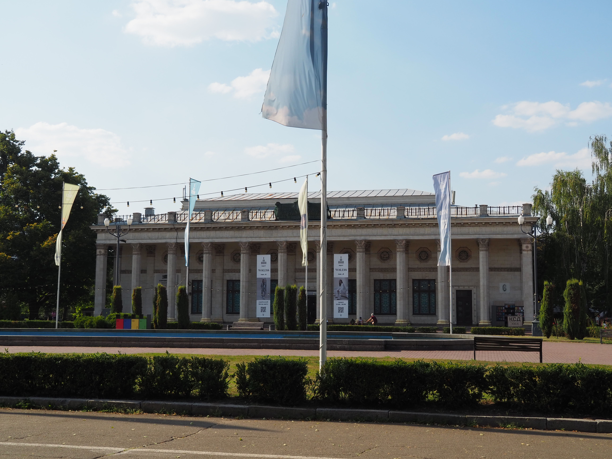
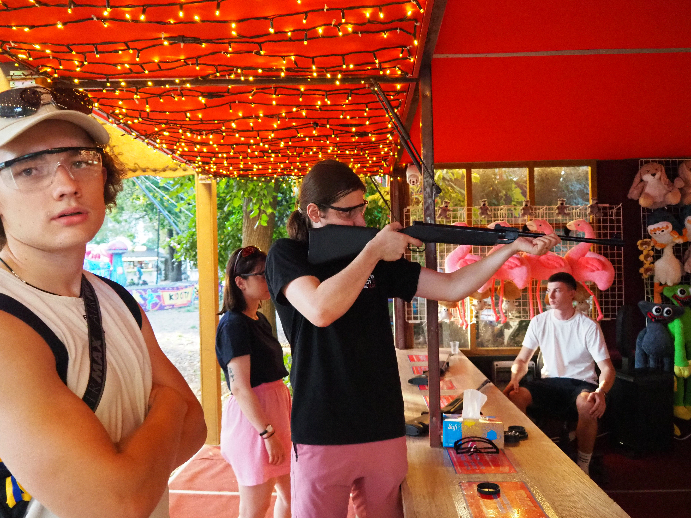

# VDNH

Le parc VDNH (ou VDNG) (prononcé _vé-dé-ène-hé_), acronyme de _Exposition des
Réalisations de l'Économie Nationale de la RSS d'Ukraine_ est un grand parc
d'expositions, ouvert en 1958.

Il est renommé en Expocenter Ukraine à l'indépendance, mais contrairement aux
autres monuments, son nom soviétique reste très utilisé, y compris dans des
[communications officielles](https://vdng.ua/).

C'est un parc qui a gardé beaucoup de symboles soviétiques, malgré leur
illégalité. Je suppose qu'ils sont tolérés parce que le parc est très beau et
qu'il serait difficile de tout remplacer sans l’abîmer. C'est aussi un lieu de
loisir, loin du centre de Kyiv, ce n'est pas vraiment l'endroit le plus
symbolique de la puissance de l'État.

On loue une sorte de scooter électrique, plus pour jouer que pour se déplacer
car on ne peut pas tous monter dessus.

On s'éloigne un peu des monuments à colonnes pour aller dans un bar en plein air
qui a des hamacs dans un verger de pommes.

On passe un certain temps ici, avant d'aller vers un coin avec des installations
sportives.

On va ensuite dans un stand de tir de type fête foraine.

Malgré le sexisme de ces photographies, les filles tirent aussi, on voit qu'elles
ont aussi des lunettes de protection.

Après cela, il commence a se faire tard, et le soleil se couche, il y a une très
belle lumière, je vais prendre plein de photos.

Comme je prend plein de photos, tout le monde m'attend et s'ennuie.

[Page suivante: le départ d'Alice, Coline et Vova](kyiv_5_depart.md)

