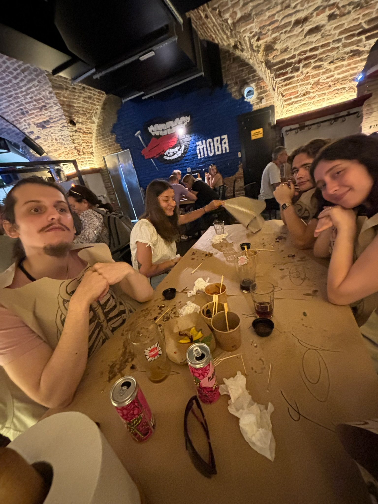
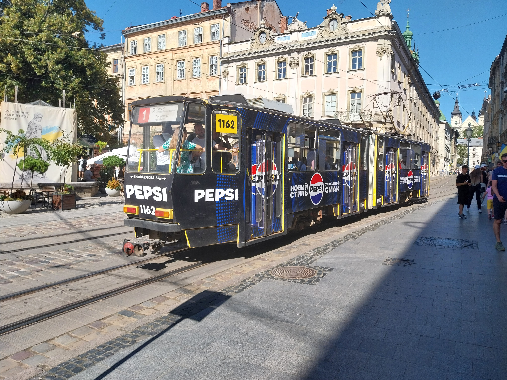

# Le trajet

Il n'est plus possible de se rendre en Ukraine par avion. Je l'avais fait en
2021, mais dans un espace aérien disputé, le risque de descendre un avion de
ligne est beaucoup trop élevé, les opérateurs de défenses anti-aériennes devant
prendre des décisions très rapides.

Pour se rendre en Ukraine, nous prenons donc l'avion jusqu'à Cracovie. Un bus
part pour Lviv depuis l'aéroport. Nous passerons quelques jours pour visiter
Lviv avant de prendre le train pour Kyiv, où sont nos amis et notre famille.

Coline avait oublié de prendre son billet de bus, heureusement il restait des
places et le chauffeur du bus à accepté les 20 euros que l'ont avait (ça n'est
la monnaie ni en Pologne ni en Ukraine).

Le trajet est très long, neuve heures, plus l'imprévu de l'attente à la frontière.

Après une attente assez longue, on passe la frontière.

# Lviv

On arrive à Lviv assez tard, on va à notre hôtel, puis on juste assez de temps
pour aller acheter à manger avant le couvre-feu. Comme c'était assez fatiguant
on n'a pas vraiment de photos de cette soirée.

Le lendemain on commence à visiter Lviv. Lviv a longtemps fait partie de
l'empire austro-hongrois, et cela se ressent dans l'architecture : c'est une
très belle ville dans un style européen (c'est-à-dire pas soviétique).

Cela est très apprécié des Ukrainiens, ce qui a fait de Lviv un centre
touristique. Personnellement je préfère l'urbanisme fou et un peu brutal de
Kyiv, qui est plus exotique pour un français.

Le centre de Lviv est tres piéton et vivant, il y a beaucoup de boutiques, des
restaurants et de l'activité. C'est même franchement un endroit touristique.

](images/lviv/aviatsiyahalychyny.jpg)

Un certain nombre de restaurants ont été conçus pour être des activités
touristiques. Le contraste en frappant avec Paris ou un restaurant touristique
est en general un parasite qui profite de l'attractivité d'un monument ou lieu
pour fournir un très mauvais service (une exception qui me vient en tête est le
Bouillon Chartier).

On peut mentionner Rebernia, un immense restaurant dans le sous-sol du bâtiment
médiéval de l'arsenal qui sert des travers de porc au barbecue.

Le restaurant fourni de grand bavoirs humoristiques, et pas de couverts (ils
sont dessinés sur la nappe).

On va aussi dans un bar thème chimie :

À la sortie du bar, il y a un magasin de souvenirs avec des plein de choses
étranges, notamment des animaux (pas à vendre).

On va aussi à la boutique Piana Vichnia, qui vend de la liqueur de cerise, en
bouteille ou à emporter dans un gobelet.

Le chocolat est une spécialité à Lviv, et on va dans café qui sert de très bons
chocolats chaud.

La guerre est visible et présente à Lviv, même si il y a moins de bombardements que dans le reste de l'Ukraine.

On assiste au passage d'un convoi funéraire de l'armée. Tout le monde s’arrête
pour saluer le héros. Le maire sors de l'hotel de ville pour transmettre ses
respects.

Il y a pas mal de graffitis intéressants.

 est un projet assez présent dans Lviv. Il s'agit de photographies d'un mendiant qui ne porte jamais deux fois la même tenue.](images/lviv/slaviks_fashion.jpg)

On se balade dans les hauteurs de Lviv, qui sont plus calmes et où on a de très
beaux points de vue sur la ville.

On monte jusqu'à un parc avec des balançoires.

Il y a de très belles vues sur Lviv depuis ce parc.

Dans un autre parc, les tourniquet n'ont pas encore les freins qui les empêchent
d'aller très vite en France.

[Page suivante: le musée ethnographique.](lviv_musee.md)
