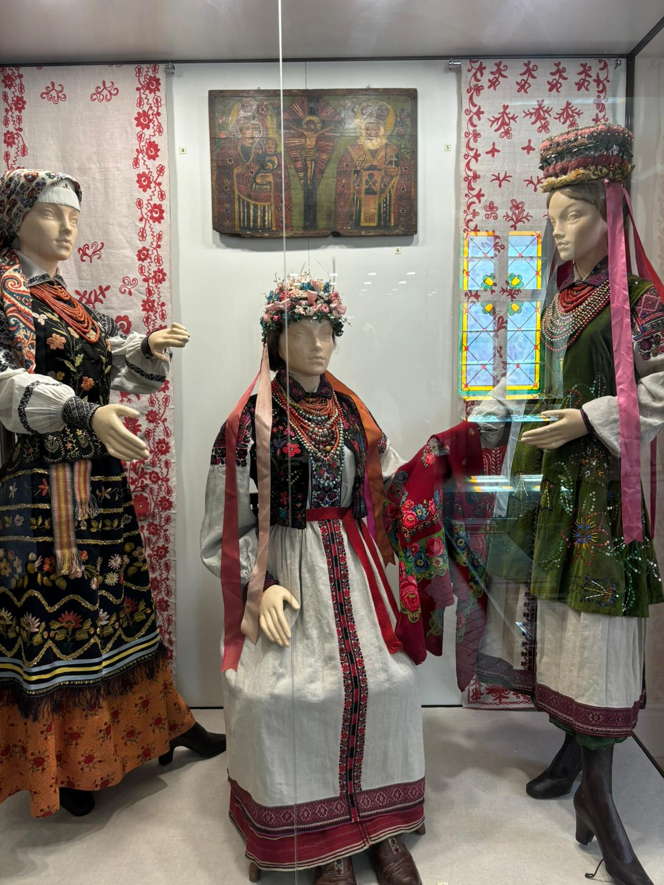
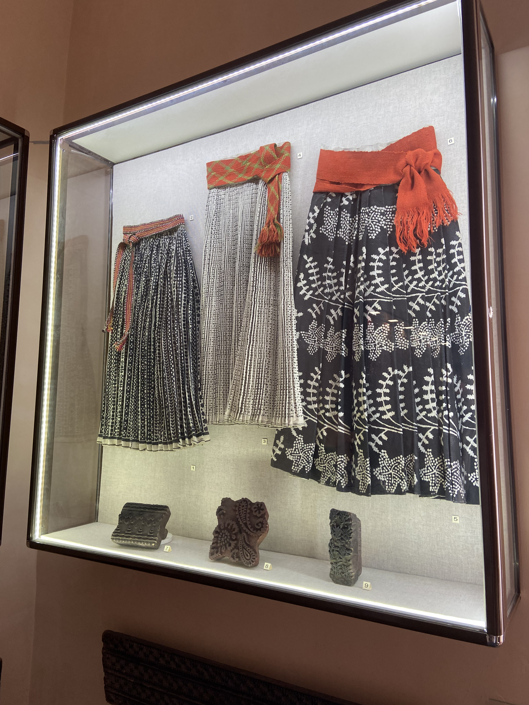
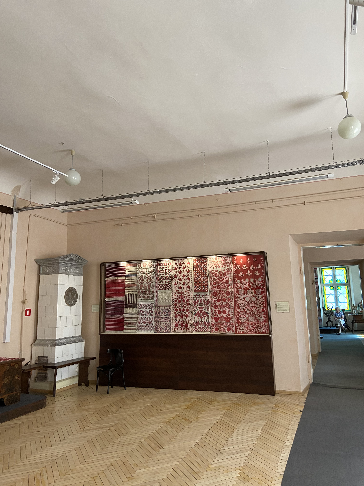
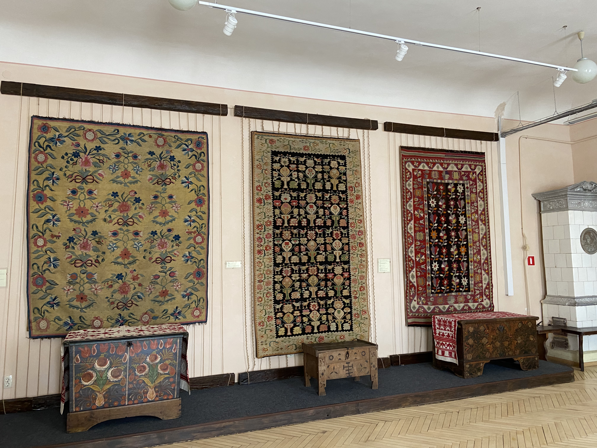
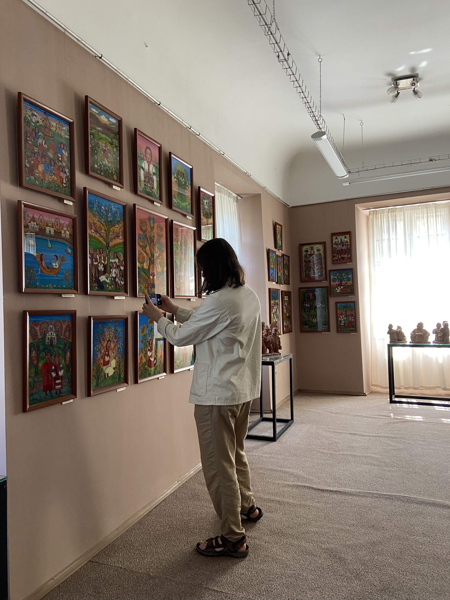
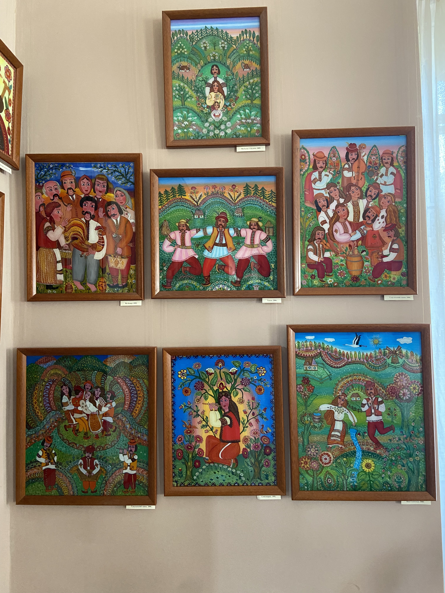
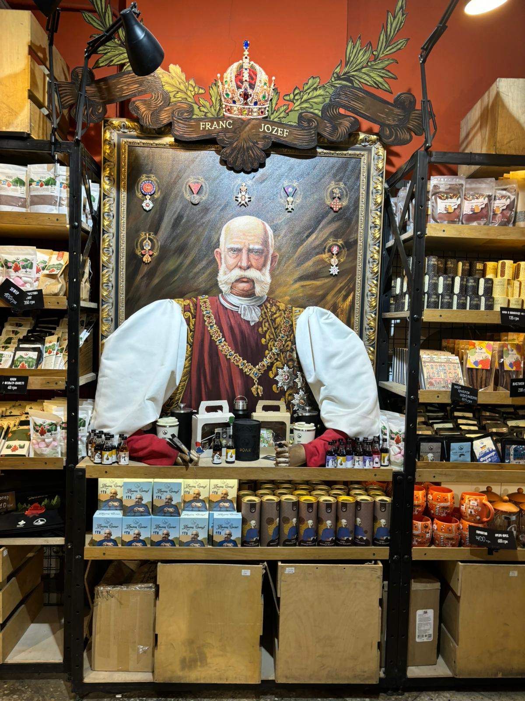

Toujours à Lviv, on visite un très joli musée, avec des tenues et objets
ethnographique au rez-de-chaussée, et des oeuvres d'art à l'étage.

À l'étage, il y a toute une exposition de peinture sur verre.

[Page suivante: le trajet vers Kyiv](trajet_lviv_kyiv.md)